# Advanced web app optiomizations

## Problems

- Latency
  - time delay between when a data packet is sent and when it is recieved , expressed in milliseconds.

## Metrics & Tools

- We cannot inprove but we can measure

### Browser-Centric metrics

- Time to first Byte (TTFB)
- First Paint
- Page Load - When everythign ready on the screen Page load is fired,

- Browser centric metrics are not so important for Web performance Optimizations

### User-Centric metrics

- first Interactive - when main thread is released, at least after couple of ms, browser is actually single thread, if thread is occuppied by something else, we cannot execute anything,
- Speed index -
- time to interactive - when we can at least can interact
- Current Layout Shift
- Largest Contentful Paint - (LCP) - initial load
- Custom metric -

### Core Web vitals

- Calculated over the 75th percentile over mobile and web
  

  - Largest Contentful Paint - (LCP) - initial load
  - First input delay - (FID) - interactivity
  - Cumulative Layout Shift - CLS - Visual stability
  - Interaction to Next paint - responsiveness\

### GOALS

- LCP : 2.5s - 4.0s
- FID: 100ms - 300ms
- CLS: 0.1 - 0.25

- analyses :
  - [PageSpeed Insights](pagespeed.web.dev)
  - [Performance issues and optimizations](https://www.webpagetest.org/)

## Basic Optimizations

- Browsing the web

  - Network Layer
  - Parsing
  - Resource discovery Phase
  - Recourse Prioritize
  - Layout
  - Paint

- www.frontendmasters.com
- 1 - DNS query - browser needs an ip address - ~~~ 100ms
- 2 -TCP connection - 120ms
- 3 -SSL negotiation - 150ms
- 4 -HTTP Request - uplink

  - header - body

- 5 - Server process (backend time) - 200ms to 500ms
- 6 - HTTP Response - downlink
  - header - body
- 7 - Browsers HTML Parsing
- 8 - Resource Discovery & Priority
- Render(layout and paint)

- Why every website should be https not http,
  > learn this more

---

#### HTTP/1.1

- One request per TCP connection
  - if i open, i can request only one file
  - if i need request in paralled like example 8 files , i should open 8 times in a row ,
  - GZIP Encoding is accepted

#### HTTP/2

- Performance from scratch
- Header Copressions
- TCP connections reuse
- TLS based only
- Good compatibility
- upgrade your servers or user a CDN
- Upgrade connections

#### HTTP/3

- Transport protocol over UDP
- Reduces latency and connection messages
- HTTP/2 Interface with TLS
- [http Archive](https://httparchive.org/)

### Browser cache

- Resouce discovery Queue

  - Cache headers per file

    - Absolute expiration date (1.0)
    - Relative expiration date (1.0)
    - More specs / values

  - Browser needs a resource
    - It checks the cache
      - Cache Miss: we will go to network
      - Cache HIT:
        - it is expired
          - conditional request: asks server hey server i have this file in this version then server responds with :
            - not modified (it can attach updated cache headers)
            - okay new file(200)
        - it is not expired
          - we use the file from the cache

### bfcache

- back/forward chache

  - it keeps you page navigation in memory if the user navigates away
  - it is automatic
  - you should not use unload events
    cache-control: no-store
  - use page navigation Api to
    - Open/restore connections
    - Abort pending transactions

  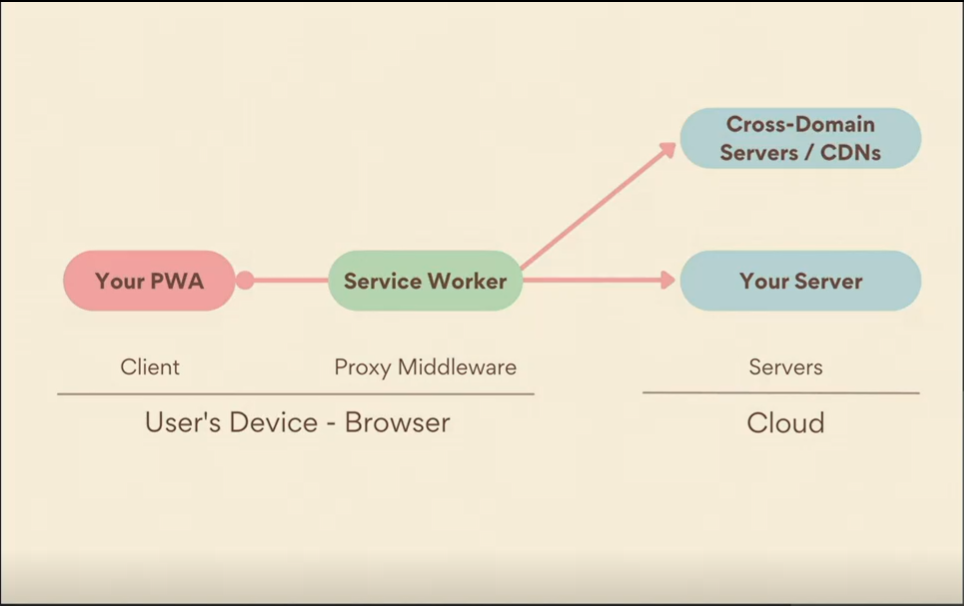
  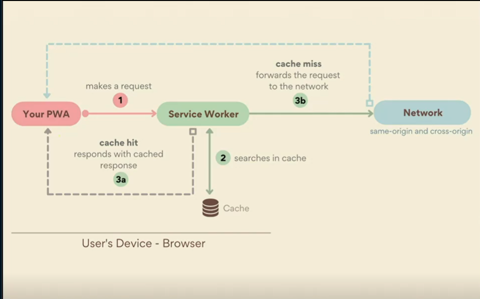

###

#### Frames and interactivity

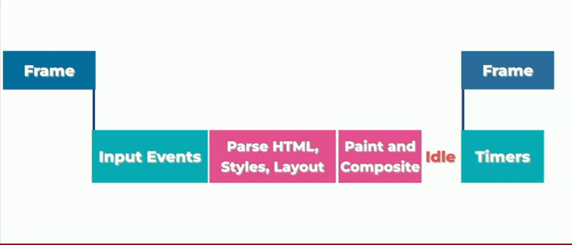

### Basic OPtimizations

- Enable GZIP on text-based files

  - HTML ( Static and dynamic)
  - Javascript, Scc, JSON, SVG

- Make static content expire late in future
- Use a CDN for static content
- Consider implemention HTTP/2 and HTTPS
- Use cookie-less domain
- Reduce cookie size
- Reduce redirects
  - consumes 100ms to 1s
  - social networks will use one

### CSS as apetizer

- We should laod the css as soon as possible, cuz browser needs that in order to render, what is why css is render blocking,

### Javascript as dessert

- defer it as much as possible
- it uses the main thread
- remove or defer unused code
- use defer and async

> compress / obfuscate javascript and css
>
> Release main thread as soon as possible
>
> Embreace Responsice images
>
> Embreace SVG
>
> Compress images
> Define placeholder siz
>
> Careful with Web Fonts

## Advanced Optimizations

### Optimizing first laod

- Avoid more than one roundtrip

  - TCP slow start
    - TCP sends the file in chunks , and sometimes some could be lost , and tcp should send another one, so in that case browser just waits enough resouce to start parsing, so can we send that in only first tcp packet,
    - Initial Congestion Window (initcwnd)
    - Linux: 14.6 KiB
      - 1KB === 1000 bytes - not in the windows
      - 1KiB === 1024 bytes

- Deliver ATF in 14.6 KiB
  
  - Embeded all css and javascript needed
  - if space, embeded logo / or low-res images
- Avoid http to https redirects

  - Use HSTS (HTTP Strict transport Security)
  - Header
  - Opt-in at [hstspreload.org](hstspreload.org)

### avoiding preload

- We can preload as in the html file [go there](./adv-webperf/public/index.html)
- or we can change the priority of the file

### HTTP early hints

- HTTP Code 103
- We sent it before processing server-side
  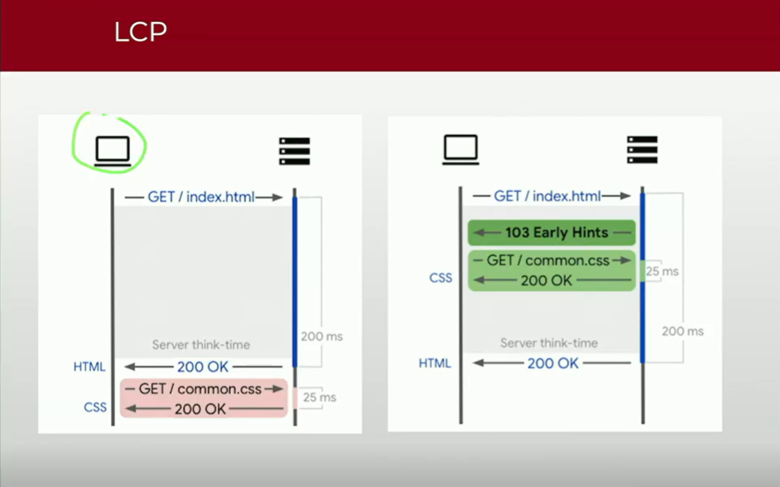

### Hacking data transfer - HTTP/2

- Transport protocol
- reduces latency and connection messages
- HTTP/2 interface with TLS
  

- [Use Zopfli](https://github.com/google/zopfli)

  - Save 3-8% data tranfer with GZIP
  - it is ~80 x slower in encrypting that means in the server that is actually pretty good

- [use Brottoli](https://github.com/google/brotli)
  - Save ~25% data transfer conpared with GZIP
  - check encoing header if the browser is supporting brottoli

### Using modern image formats

- Modern image formats
  - SVg
  - WebP, AVIF, Guetzli JPEG, Zopfli PNG
  - Muted videos instead of Gifs
    use [sqoosh](https://squoosh.app/)

### Resource loading

- Modern cache control
  - Hash in filenames is common for versioning
  - Browser makes conditional requests
    - if we have file that will never expire, in order to avoid conditional request we should add this header :
      - we can use `Cache-Control: immutable`
  - it is comon new pattern to
    - serve from the cache
    - update it in the background for later
    - header is :
      - Cache-Control: stale-while-revalidate=99
- Warming up the engines
  - Help the browsers to start ASAP
  - Help DNS Queries: ~100ms
  - Help TCP and TLS connection: ~100ms
  - we could do , say do not download the file but at least go that domain and bring the api, before you know that you will need it
    - Announce DNS queries
      - `<link rel='dns-prefetch' href='https://newdomain.com'`
        - it is actually not downloading the file it is fetching the dns
    - we can announce TLS connection, like we say why dont you go and start opening the connections in case you will need it
      - `<link rel='preconnect' href='https://newdomain.com' crossorigin>`
        - there browser does not know what to download what to reuqest, but starts opening the connections

### Lazy Loading Images & fonts

- Lazy load for Images

  - ``

- Async aimge decoding

  - ``
    - sync - when image is very important , says stop everythiong go and decode that image
    - async

- Web Fonts
  - Avoid FOUT(Flash of unstyled Text)
  - font-display: optional or swap
    - swap : it goes to that font-family , it waits around 200ms, if uit cannot get any font within that time, it goes to the next font on the list and apply the next one, but after a moment if the first font appears it just swap fonts
    - optional: it says if u cannot load the font take the next one and apply that premamently, but in this one browser waits a bit more like 800ms

### HTTP Client Hints

- Browser will expose data to the server

  - `<meta http-equiv="Accept-CH" content="DPR, Viewport-Width, Device-Memory">`

- We can ask today for
  - RTT
  - Downlink
  - ECT (2g, 3g, 4g, slow-2g)
  - Save-Data
  - DPR and Viewport-Width
  - Device-Memory

### Hacking Interactions

> [!TIP]
> Stop Client Side Rendering, it is bad idea

> [!TIP]
> Stop serving legacy code

- Reactive Web Performance

- Know about the context with APIs

  - Network informations
  - Performance optimizations
  - save-data client hint
  - device memory client hint

- Provide a consistent experience

  - Web fonts
  - Change SW's cache
  - SSRand CSR
  - Reduce amount of loaded data
  - 1x image not matter DPR

- Get reports from the Browser

  - Reporting API
  - Report-To Header with a server endpoint

- API for WebPerformance

  - then work for client side
  - can be shared tothe server, automatically or manually
  - not every api is available on every browser
    -fallback to polyfills , other solutions or previous stats

- we can measure
  - timings for DNS, HTTP requests and response
  - typeof connections 2, 3, 4G and others
  - bandwidth and latency (RTT)
  - device's memory
  - custom metric for own goals

### Real user monitoring (RUM)

- When working statically, we don't know how our users are accessing the website, so our measurements are not real
- We can make analytics on every user to improve their experience and also create stats to improve our local testings

## Performance APIs

### Navigation timing apis

- It's available on all browsers;
- It’s on the window global object
- Also on Web Workers
- It’s a global performance object
  > check Performnce API in the console

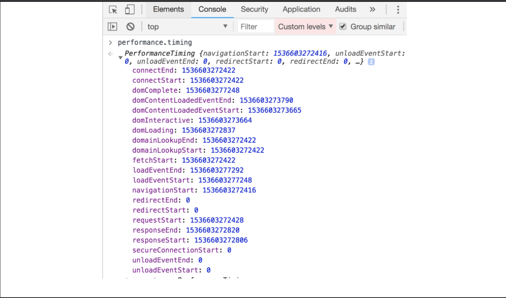

---

---

---

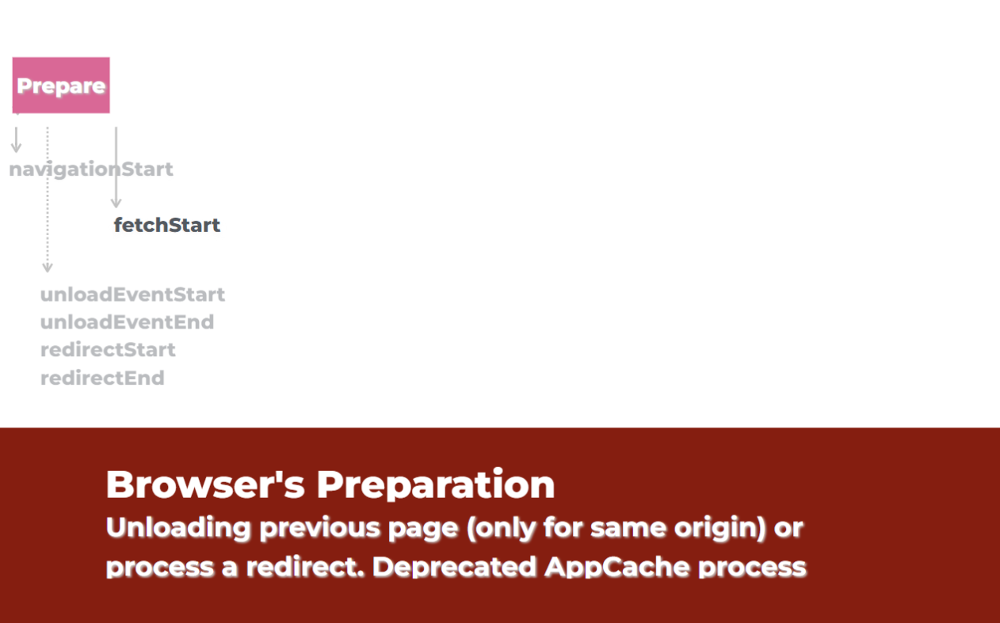

---

---

---

---

---

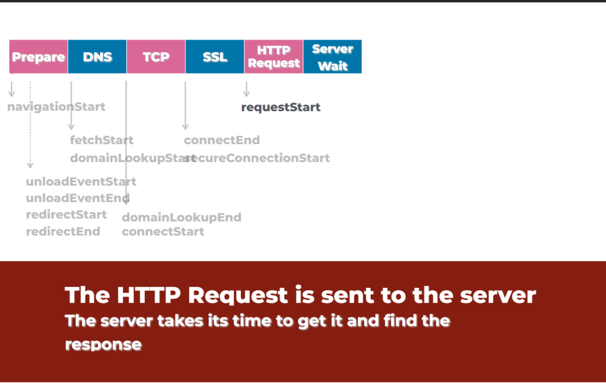

---

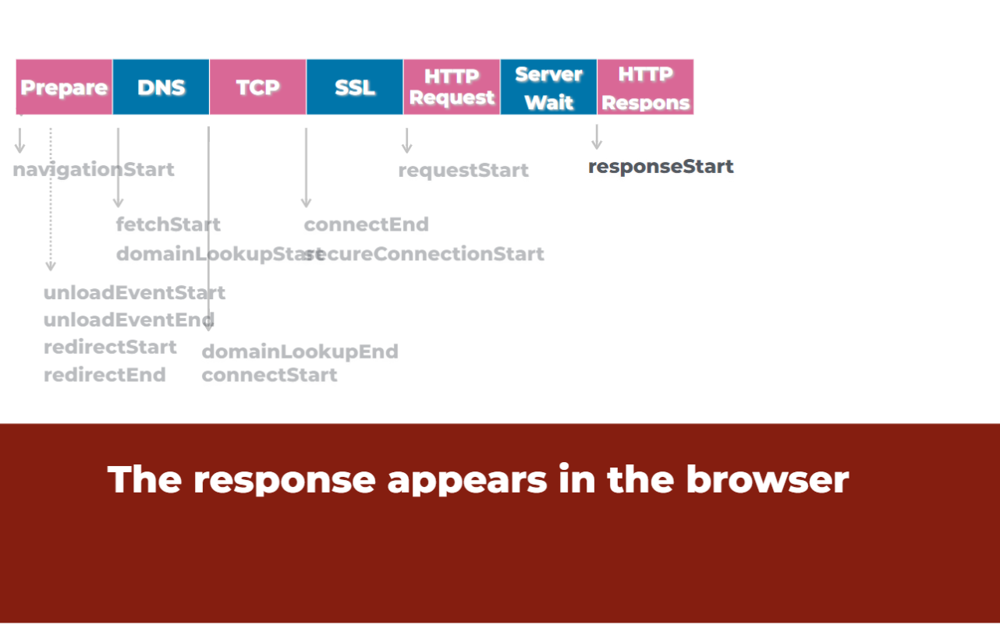

---

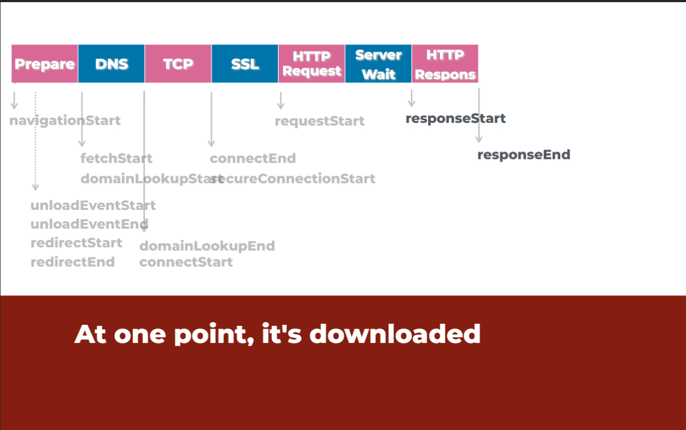

---

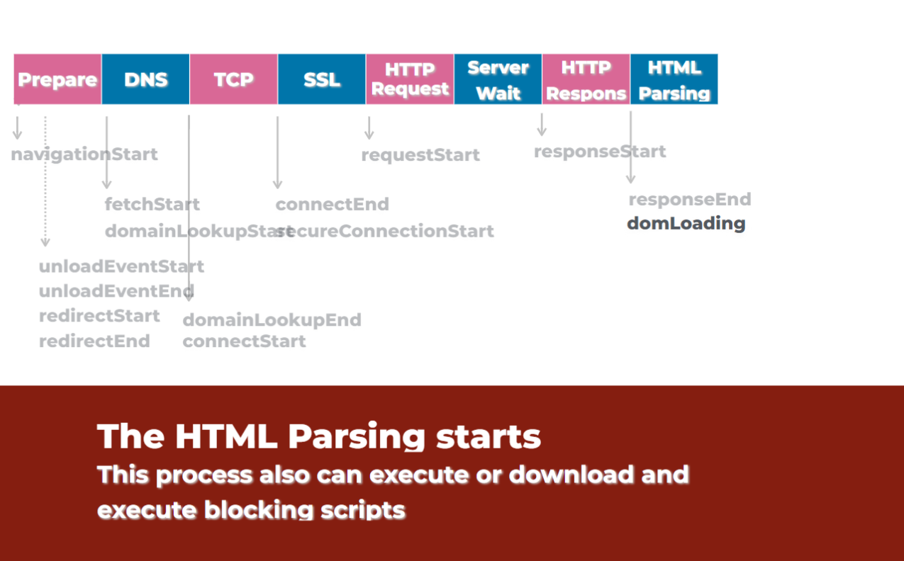

---

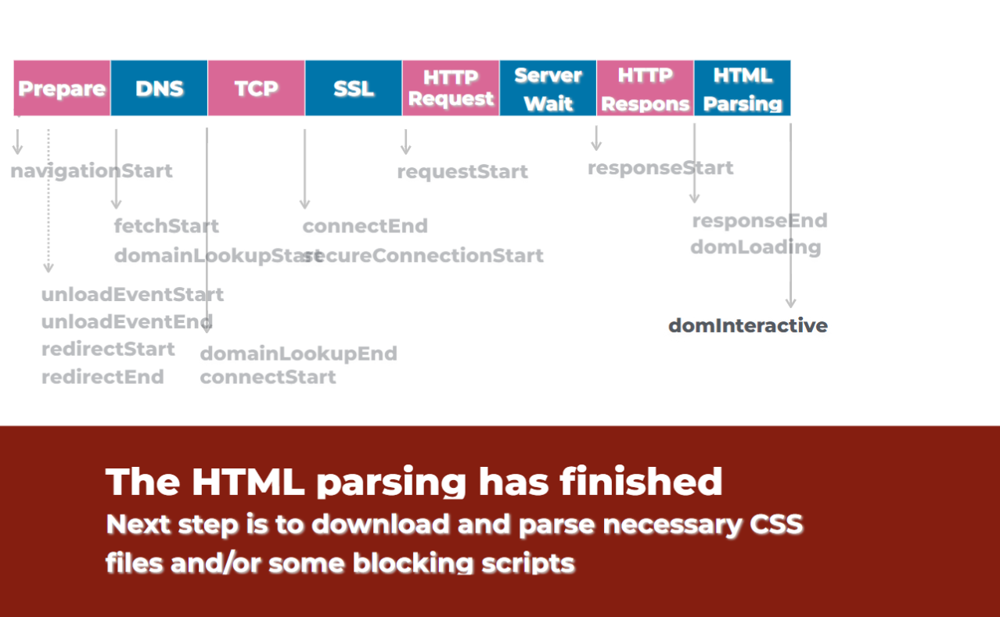

---

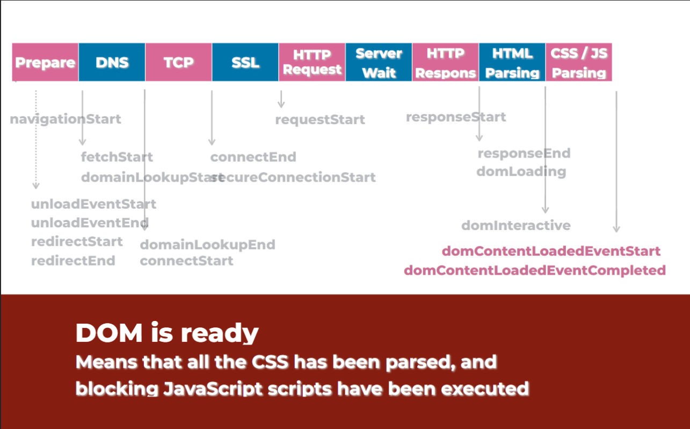

---

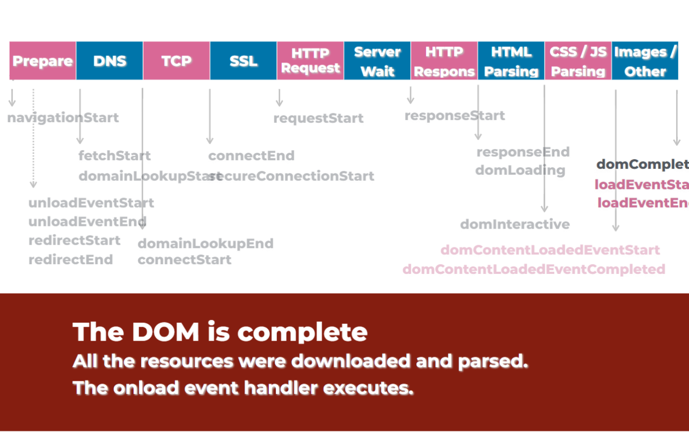

---

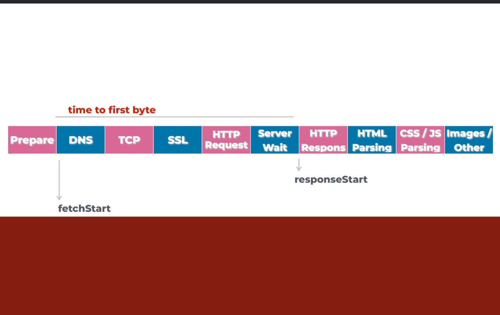

---

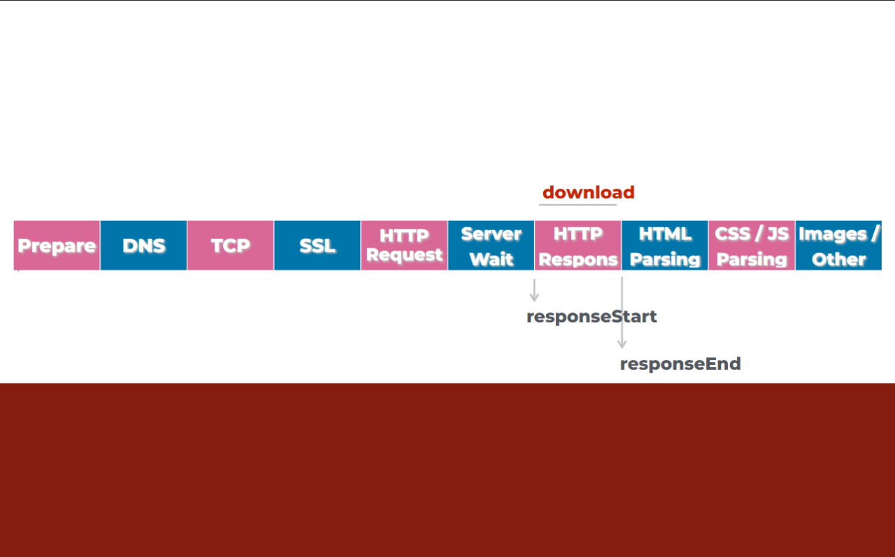

---

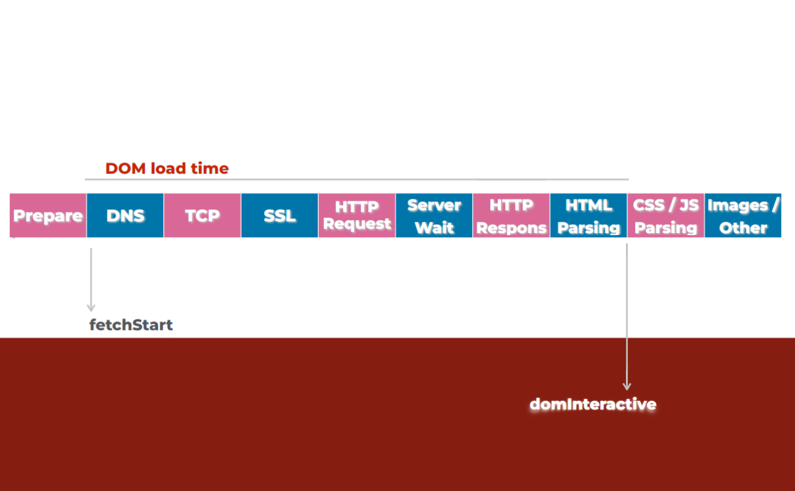

---

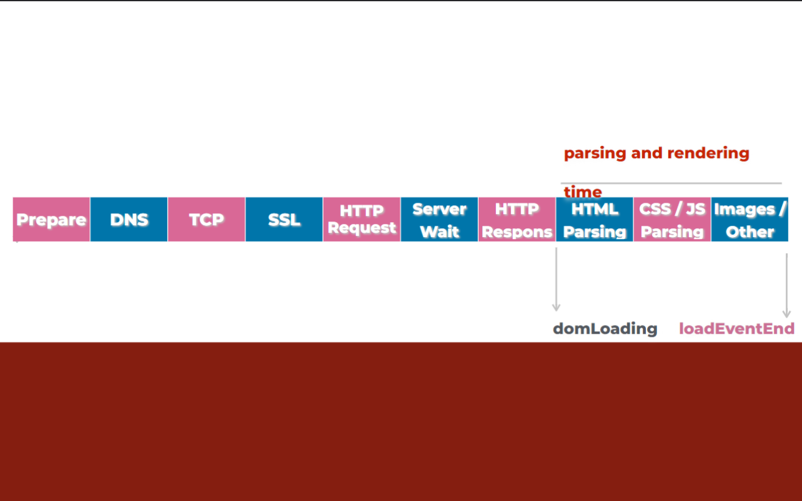

---

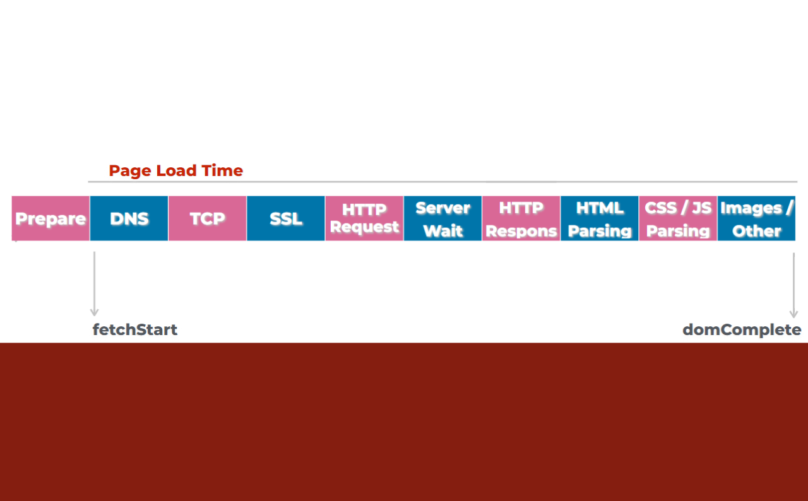

---

### Performance Standars

- `performance` property in window and Wroker's contexts
- it works with collections of metrics, know as 'Entries'
- we can query entries using filters with getEntries(filter)
- ...by type with getEntriesByType(type)
- ...by name with getEntrisByName(name, type)

### Entries' Types

- `navigation` and `frame` navigation timings(Navigation timing 2)
- `resource`: for each resouce (Resource Timings)
- `mark`: custom user entry timings (User timings)
- `measure`:custom measure between two user entry timings (User Timing)

### PerformanceEntry Properties

- name
- entryType
- startTime
- duration

### Performance Observers

- getEntries methods should be called after the events actually happened
- A new version of the Performance Timeline (L2) let us create observers
- They will be executed every time there is new data in one particular entry type

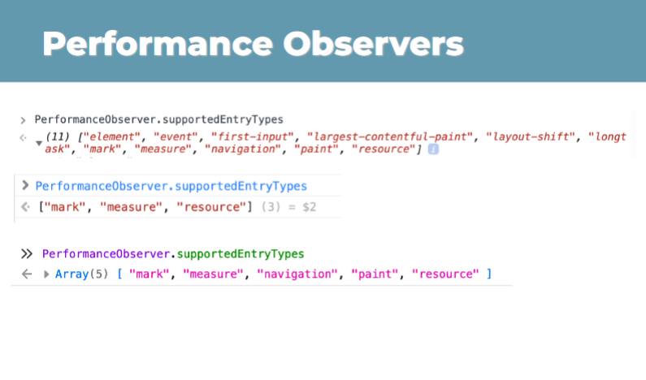

### Device Memory

- Available on some browsers
- It gives us a number expressed in GiB(Gibibytes) { 1, 2, 4, 8}
- 1 Gib = 1024 MiB

- deviceMemory
  - 0.25 GiB: minimum value
  - < 1 GiB: low end device
  - 1-2 GiB: mid end device
  - 2-4 GiB: high end device
  - 4-8 GiB: probable desktop
  - 8 GiB: maximum value

### Save Data Flag

- Available on some browsers
- It's a boolean Flag
- It sits on top of Network Information API

### Client-side and Server-side

- NetInfo, Device Memory, Responsive Queries and Save-Data are client-side accessible only
- Sometimes we want to access the data in the server
- Apply Reactive Web Performance techniques
- Serve better Responsive Images

### Meet Client-Hints

- HTTP spec to opt in for hints from the client to the server
- Through a meta tag or a Response header
- Let us make decisions on the server
- It can be polyfilled with Service Workers or Cookies

### Animation frame

- Part of the latest HTML5 spec
- Let us execute code on next frame before painting it
- it is guaranteed to be executed on next frae
- better than timers
- We should keep code small ( <10ms )
