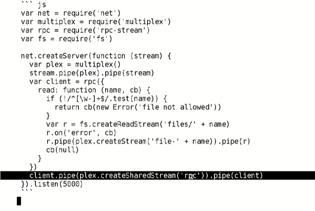

# Learn Networking and Streams

# any networked computer can be a server

# any networked computer can be a client

# tcp vs udp

## tcp - reliable transport: if a packet is not acknowledged (ACK) on the other end, it gets resent

- everyting else

## udp - unreliable transport: packets are snet but there is no confirmation that the packets was recieved at the other end

- sometimes used for streaming video and audio , some games

# protocols

- the language that computer programs speak each other
- example of protocols

  - http - browse web pages - 80
  - https - browse pages with encryption - 443
  - smtp - send and recieve emails - 25
  - imap, pop3 - load emails from an inbox -
  - irc - chat - 6667
  - ftp - file transfer - 21
  - ssh - remote shell over an ancrypted connection - 22
  - ssl - low level secure data transfer (used by https) -

  - mysql - 3306
  - postgresql - 5432
  - couchdb - 5984

# peer to peer

- aside from servers and clients, there is a third role in computer networks : peer
- in peer to peer network, clients establish connections directly to other clients. Nodes in the network are symmetric with not fixed central servers
- example
  - bittorrent
  - webrtc

## experiment with netcat

    - server : ncat -lp [port number]
    - client : ncat localhost [port number]
    - there we can have tcp connection chat

# http

    - hyper text transfer protocol
    - how web servers and web brosers communicate

# http verbs

    - https request begin with a verb
    - here are some things each verb is used for :
        - GET
        - POST
        - HEAD
        - PUT

# http headers

- next come the headers
- headers have a key followed by a colon followed by a value

# smtp

- is the protocol used to deliver email messages
- Here we can send an email from `trump@whitehouse.gov` to `mail@ulugbekswe.com`

- the lines that start with a number are messages from the server

# text protocols

- so far we have seen a number of text protocols
  - http
  - smtp
  - irc
- these are nice protocols to implement because you can inspect the data going over the wire visually and type requests using the keyboard

# irc commands

- nick - identify as a user
- user - also identify as a user
- join - join a channel
- privmsg - send a message to a channel

# binary protocols

- in binary protocols, you cannot just type message with the keyboard like we have been doing, you have got to write programs that unpack the incoming bytes and pack outgoing bytes according to the specification

# inspecting protocols

- to inspect protocols, you can capture everthing coming out of and into you wireless or ethernet card usingL
  - wireshark for a graphical tool
  - tcpdump for a command line tool

# just read

- [smpt rfc](http://www.faqs.org/rfcs/rfc821.html)
- [smpt rfc](http://www.faqs.org/rfcs/rfc2812.html)
- [smpt rfc](http://www.faqs.org/rfcs/rfc2616.html)

# streams

- node.js has a handy interface for suffling data around called streams

# stream origins

- we should have some have ways of connecting programs like garden hose--scew in another segment whn it becomes necessary to message data in another way. this is the way of IO also

# why sterams ?

- we can compose streaming abstractions
- we can operate on data chunk by chunk

# composition

- just like how in unix we can pipe commands together

```
$ <mobydick.txt.gz gunzip | sed -r 's/\s+/\n/g' | grep -i whale | wc -l 1691
```

- we can pipe abstraction together with streams using `.pipe()`:

```javascript
fs.createReadStream('mobydick.txt.gz')
  .pipe(zlib.createGunzip())
  .pipe(replace(/\s+/g, '\n'))
  .pipe(filter(/whale/i))
  .pipe(lineCount(console.log));
```

# through2 vs stream.Tranform

- `though2(opts={...}, write, end)`
- `new Thransform({ tranform: write,  flush: end, ...})`

# through2

- with though there are 2 parameters: `write` and `end`.
- Both are optional

* `function write(buff, enc, next) {}`
* `function end () {}`

- Call `this.push(Value)` inside the callback to pul Value into the stream's output

* Use a `VALUE` of `NULL` to end the stream

# though()

- If u do not give through any arguments, these are the default values for write and end

- `function write (buf, enc, next) { this.push(buff); next()}`
- `function end () { this.push( null )}`

- this means that `through()` with no arguments will pass everything written as input directly through to its output

# concat-stream

`npm install concat-stream`

- concat-stream buffers up all the data in the stream:

```
var concat = require('concat-stream')
process.stdin.pipe(concat(function (body) { console.log(body.length)
}))
```

- You can only write to a concat-stream. You can't read from a concat-stream.
- Keep in mind that all the data will be in memory.

# stream types

- there are many kinds of streams. We have seen two types already : transform (through2) and writable (concat-stream)

- readable - `readable.pipe(A)` - produces data: you can pipe FROM it
- writeable - `A.pipe(writable)` - consumes data: you can pipe TO it
- transform - `A.pipe(transform).pipe(B)` - consumes data, producing transformed data
- duplex - `A.pipe(duplex).pipe(A)` - consumes data separately from producing data

# writable streams

- We have seen `.pipe()` which is a method of all readable streams (readable, transform, and duplex)

- Any stream you can write to writable, transform, and duplex streams has these methods

* `.write(buf)`
* `.end()`
* `.end(buf)`
* `.on('finish', function () {})`
* `(...).pipe(stream)`

# readable stream methods

- `stream.pipe(...)`
- `stream.once('end', function () {})`

* you probably wont need to call theese very often

- `stream.read()`
- `stream.on('readable', function () {})`

* you can ket a module or `.pipe()` take care of calling those

# readable: paused mode

- default behavior with automatic backpressure

- turn on the flowing mode with :

* `stream.resume()`
* `stream.on('data', function (){})`\

# transform

- readable + writable stream where :

```
input => transform => output
```

- All the readable AND writable methods are available

# duplex

- readable + writable stream where
- input is decoupled from output

like telephone

```
input => duplex
duplex => output
```

# object stream

- Normally you can only read and write buffers and strings with streams However if you initialize a stream in `objectMode`, you can use any kind of object (except for `null`)

```js
var through = require('through2');
var tr = through.obj(function (row, enc, next) {
  next(null, row.n * 1000 + '\n');
});
tr.pipe(process.stdout);
tr.write({ n: 5 });
tr.write({ n: 10 });
tr.write({ n: 3 });
tr.end();
```

# core streams in node

- many of the APIs in node core provide stream interfaces:

- fs.createReadStream()
- fs.createWriteStream()
- process.stdin, process.stderr
- ps.stdin, ps.stdout, ps.stderr
- net.connec(), tls.connect
- net.createServer(function(stream){})
- tls.createServer(opts, function (stream) {})

# HTTP core streams

```js
// req: readable,res:writable
http.createServer(function (req, res) {});

// req: writable, res.readable
var req = http.request(opts, function (res) {});
```

# zlib core streams

# split2

- split input on newlines

- this program counts the number of lines of input, like `wc -l`

```js
var split = require('split2');
var through = require('through2');

var count = 0;

process.stdin.pipe(split()).pipe(through(write, end));

function write(buf, enc, next) {
  count++;
  next();
}

function end() {
  console.log(count);
}
```

# websocket-stream

- streaming websockets in node and the browser

```js
var http = require('http');
var wsock = require('websocket-stream');
var through = require('through2');

var server = htts
  .createServer(function (req, res) {
    res.end('not found\n');
  })
  .listen(5000);

wsock.createServer({ server: server }, function (stream) {
  stream.pipe(louder()).pipe(stream);
});

function louder() {
  return through(function (buf, enc, next) {
    next(null, buf.toString().toUpperCase());
  });
}
```

# collect-streams

- collect a stream's output into a single buffer
- for object streams, collect output into an array of objects

```js
var collect = require('collect-stream');
var split = require('split2');

var sp = process.stdin.pipe(split(JSON.parse));
collect(sp, function (err, rows) {
  if (err) {
    console.log(err);
  } else {
    console.log(rows);
  }
});
```

- this modules is very useful for unit testing

# from2

- create a readable stream with a pull function

```js
var from = require('from2');
var message = ['hello', 'world\n', null];

from(function (size, next) {
  next(null, message.shift());
}).pipe(process.stdout);
```

# to2

- create a writable stream with a write and flush function

```js
var to = require('to2');
var split = require('split2');

process.stdin.pipe(split()).pipe(
  to(function (buf, next) {
    console.log(buf.length);
  })
);
```

# duplexify

```js
var duplexify = require('duplexify')
var d = duplexify()

d.setReadable(...)
d.setWritable(...)
```

# pump

- it does not crash when there any error occurs on the pipe stream, it eats the error, in the end of the stream u can handle error if u want

```js
var pump = require('pump')

pump(stream1, stream2, stream3, ...)
```

# pumpify

```js
var pump = require('pumpify')

var stream = pump(stream1, stream2, stream3, ...)
```

# end-of-stream

- reliable detect when a steram is finished

```js
var onend = require('end-of-stream');
var net = require('net');

var server = net.createServer(function (stream) {
  var iv = setInterval(function () {
    stream.write(Date.now() + '\n');
  }, 1000);
  onend(stream, function () {
    clearInterval(iv);
  });
});
server.listen(5000);
```

# rpc-stream

- call nmethods defined by a remote endpoint

```js
var net = require('net');
var rpc = require('rpc-stream');

net
  .createServer(function (stream) {
    stream
      .pipe(
        rpc({
          hello: function (name, cb) {
            cb(null, 'howdy ' + name);
          },
        })
      )
      .pipe(stream);
  })
  .listen(5000);
```

# multiplex

- pack multiple steam into a single stream

- 
