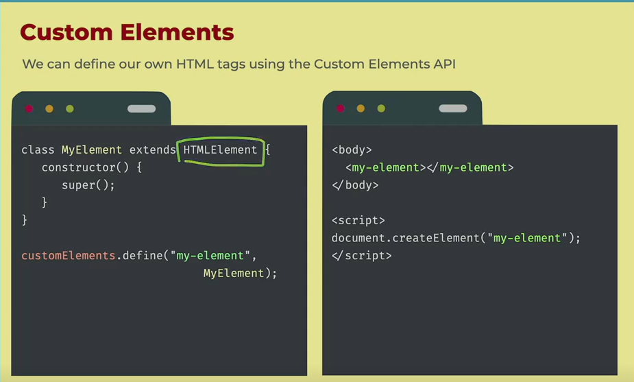
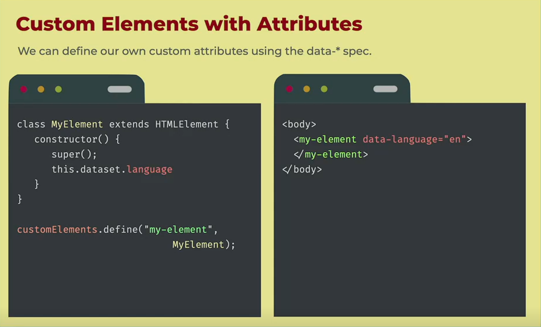
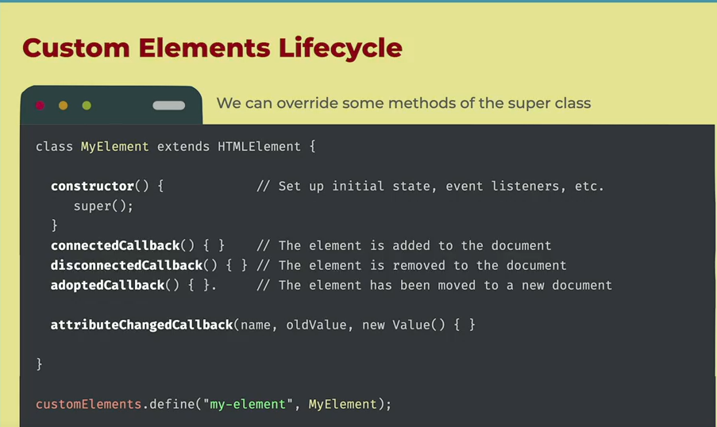
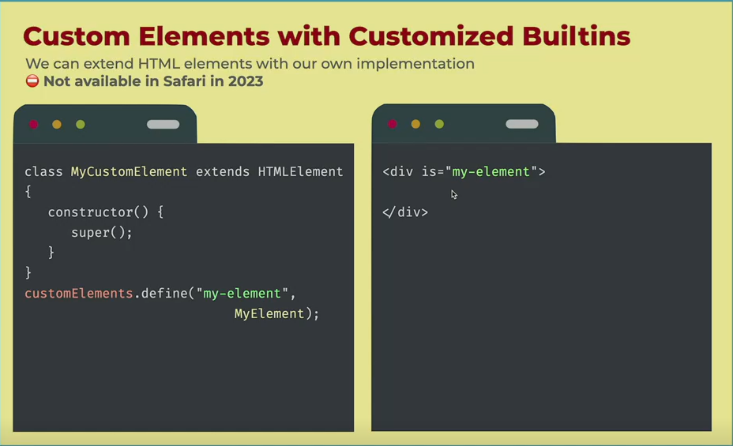
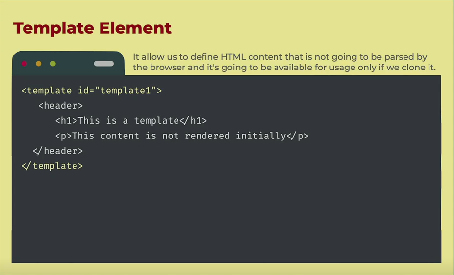
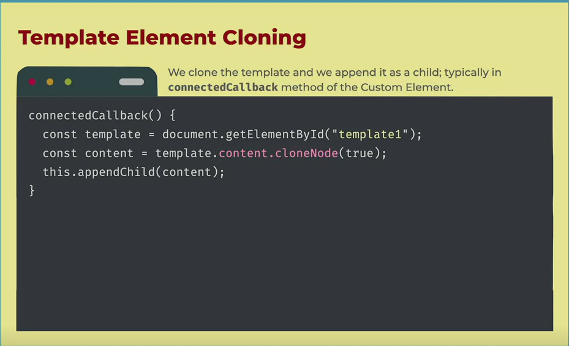
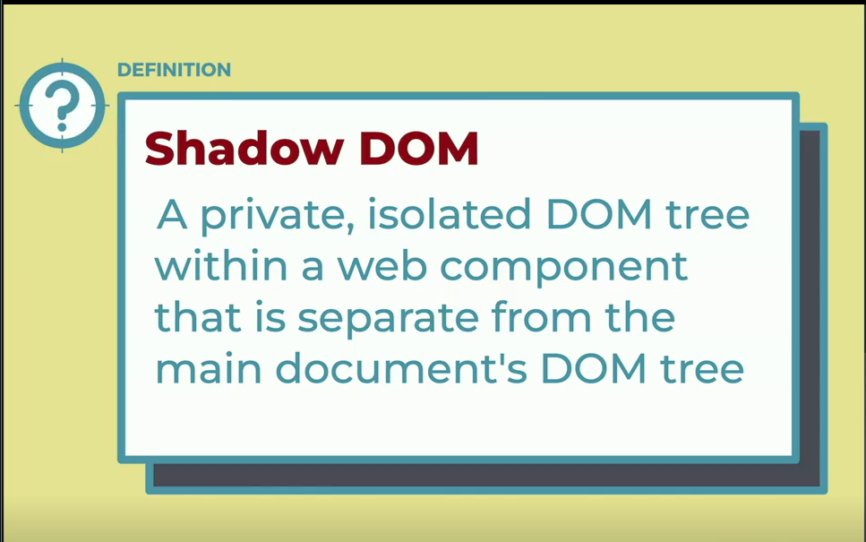
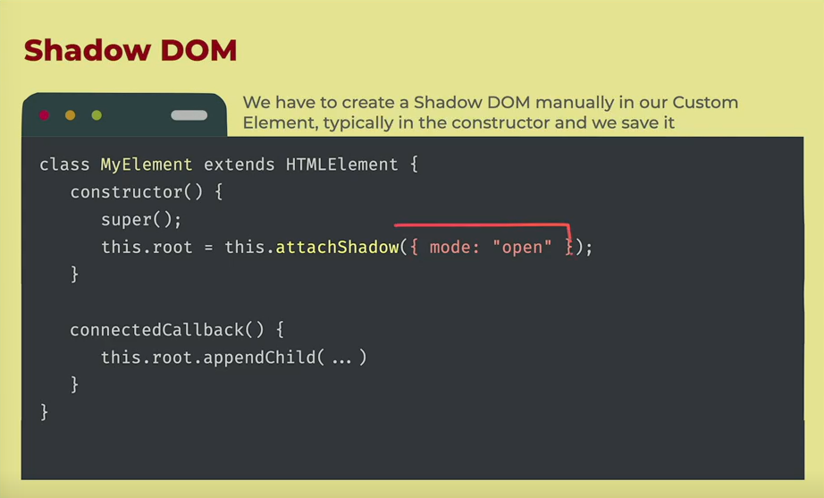
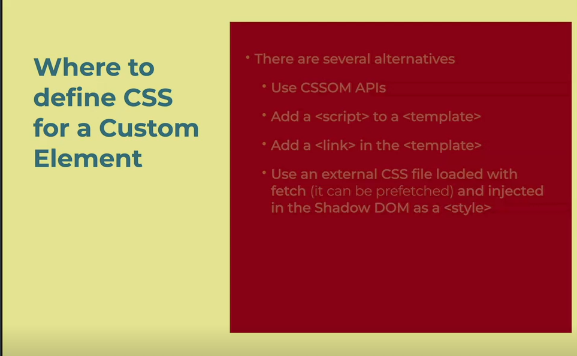
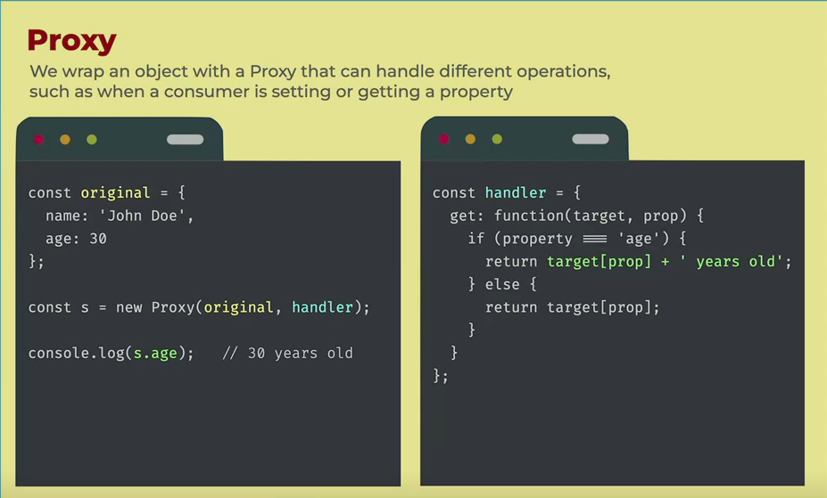

https://firtman.github.io/vanilla/lessons/routing/initializing-router-service

# Vanilla js

- The usage of the core langugae and browser APIs to create web apps without any additional libraries or fframeworks added on top

## Why Vanilla Javascript

- Why do we need to care about VanillaJS

  - Add one more tool to your toolbox
  - Undersand what your library is doing
  - Extend library with plugins
  - be a better web developer
  - to mix with libraries
  - FrontendMasters.com is VanillaJs

  - to use it!
  - you can create simple and fast webapps with no CLI no build process

- Main Advantages of Vanilla JS

  - Lightweight
  - Control and Power
  - Simplicity
  - Flexibility
  - Performance
  - Compatibility
  - No node-modules

- Main Fears of Vanilla js
  - Routing for single page applications
  - Too Verbose and time consuming
  - State Management
  - Templating
  - Complexity
  - Reusable COmponents
  - Maintenance
  - Learning Curve
  - Browser compatibility
  - Reinventing the wheel every time
  - Scalability

## DOM API

- DOM

  - the document object model connects web pages to Javascript by representing the structure of the document in memory

- DOM API

  - A browser API exposed to developers to manipulate the DOM from an scripting langugage

  - The Dom API is available on many objects
    - window global objects
    - document object
    - One object per HTML elemnt and other nodes in your document

## Event Binding

    - Each DOM element has a list of possible events we can listen to:
        - Basic:
            - load
            - click
            - dblclick
        - Value:
            - change
        - Keyboard Events:
            - keyup,
            - keydown,
            - keypress
        - Mouse Events:
            - mouseover,
            - mouseout, etc.
        - Pointer and Touch Events
        - Scroll, Focus and more APIs
        - Some specific objects have special events:
        - DOMContentLoaded, popstate in window

    - Binding function to events in DOM objects
        - onevent properties
        - addeventListener

## We can dispatch event

## Single page application router

- we want to chantge the content of the page based on what user select

  - Home: page menu
  - Details of one particular product
  - order:cart details and order form

- We wont have multiple HTML files, we will use DOM APIs and Web Components
- We will use the History API to push new entries to the navigation history
  

- popstate wont be fired if the user clicks on an external link or changes the URL manually
- If u are creating a SPA , configure your server properly and check the URL when the whole page loads for the first time

## Router Idea

- Make the router reusable by recieveing a collection of router (path as a regex and components to render)

## Web components

- A modular, reusable building block for web development that excapsulates a set of related functionality and user interface elements
- in short it is our custom html tag element

- compatible with every browser
- it is actually a set of standards
  - cuustom elemnts
  - HTML templates
  - Shadow DOM
  - declarative shadow dom
- it is similar to the idea of components on most of the libraries for javascript
- we have freedom of choice on how to define them and use them

## Custom element

- A way to define new, reusable HTML elements with custom behavior and functionality using JavaScript.
  
  
  
  

## Template element

- Fragments of markup that can be cloned and inserted into the document at runtime, with reusable HTML content that can be rendered and modified dynamically.
  
  

  - By default, the nodes of our custom element are part of the same page's DOM, so CSS style declaration applies to all the document.

## Shadow DOM

- Allows more control over styling and
  encapsulation of functionality of a Custom
  Element.
- By default, CSS declared in the main DOM
  won't be applied to the Shadow DOM.
- CSS declared in the Shadow DOM applies
  only on there.
- There are new pseudo-classes and
  pseudo-element to allow communication
  between DOMs in stylesheets.
- It can be opened or closed defining
  visibility from the outer DOM

- Where to define HTML for a Custom Element

  - There are several alternatives
    - Use DOM APIs
    - Use a `<template>` in the main HTML
    - Use an external HTML file loaded with fetch (it can be prefetched)
      - Using innerHTML
      - Using DOMParser

- 

## Proxy

- A wrapper object that lets you intercept and modify operations performed on the wrapped object, allowing you to add custom behavior or validation to the object's properties and methods.

- Proxies work with objects only. If you want to do something similar with simpler values, you can use classes with getter and setters

### Proxy haldler

- Object that contains traps for intercepting and customizing operations performed on a JavaScript proxy object.

### Proxy Trap

- Method on a proxy handler object that intercepts and customizes a specific operation performed on the target object.

- Most Used Proxy Traps

  - get
  - set
  - has
  - deleteProperty
  - apply
  - construct
  - getOwnPropertyDescriptor
  - defineProperty
  - ownKeys

- Proxy Traps are also executed when you access a method (function) of the object
- With arrays and the usage of [] accessor, you can trap get and set and the index will the the property.
- To detect changes in arrays, it's not just the accessor [], there are functions as well such as push that you can trap with apply.
