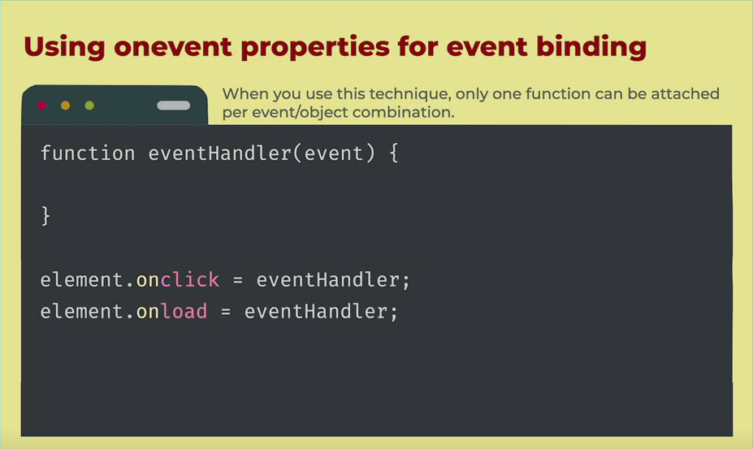
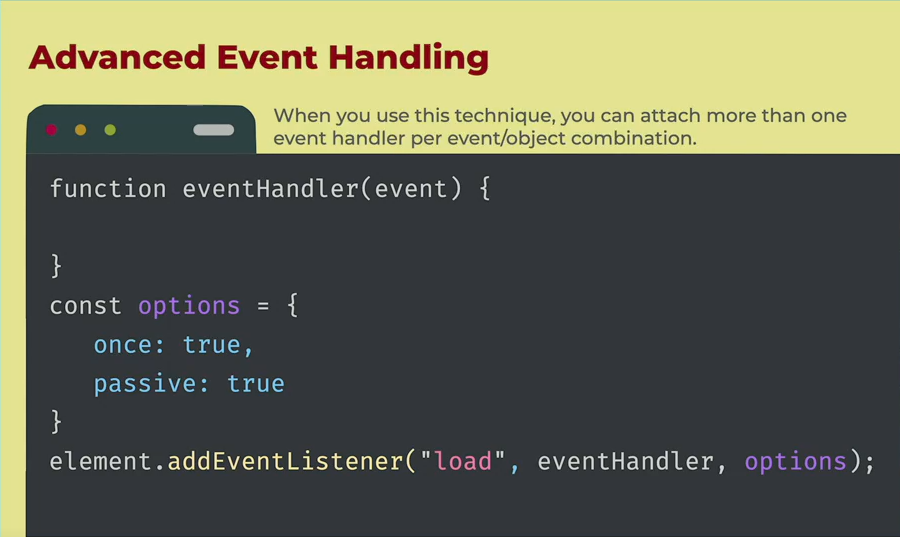
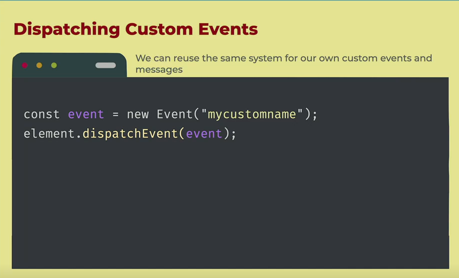
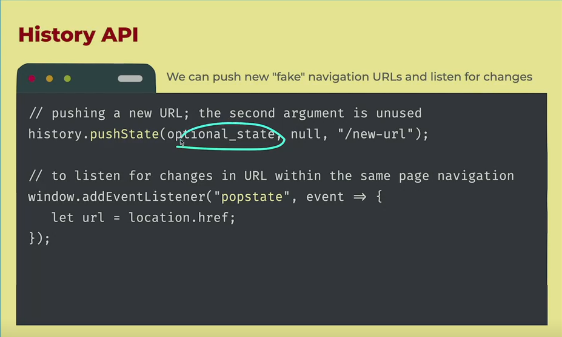

https://firtman.github.io/vanilla/lessons/routing/initializing-router-service

# Vanilla js

- The usage of the core langugae and browser APIs to create web apps without any additional libraries or fframeworks added on top

## Why Vanilla Javascript

- Why do we need to care about VanillaJS

  - Add one more tool to your toolbox
  - Undersand what your library is doing
  - Extend library with plugins
  - be a better web developer
  - to mix with libraries
  - FrontendMasters.com is VanillaJs

  - to use it!
  - you can create simple and fast webapps with no CLI no build process

- Main Advantages of Vanilla JS

  - Lightweight
  - Control and Power
  - Simplicity
  - Flexibility
  - Performance
  - Compatibility
  - No node-modules

- Main Fears of Vanilla js
  - Routing for single page applications
  - Too Verbose and time consuming
  - State Management
  - Templating
  - Complexity
  - Reusable COmponents
  - Maintenance
  - Learning Curve
  - Browser compatibility
  - Reinventing the wheel every time
  - Scalability

## DOM API

- DOM

  - the document object model connects web pages to Javascript by representing the structure of the document in memory

- DOM API

  - A browser API exposed to developers to manipulate the DOM from an scripting langugage

  - The Dom API is available on many objects
    - window global objects
    - document object
    - One object per HTML elemnt and other nodes in your document

## Event Binding

    - Each DOM element has a list of possible events we can listen to:
        - Basic:
            - load
            - click
            - dblclick
        - Value:
            - change
        - Keyboard Events:
            - keyup,
            - keydown,
            - keypress
        - Mouse Events:
            - mouseover,
            - mouseout, etc.
        - Pointer and Touch Events
        - Scroll, Focus and more APIs
        - Some specific objects have special events:
        - DOMContentLoaded, popstate in window

    - Binding function to events in DOM objects
        - onevent properties
        - addeventListener

## We can dispatch event

## Single page application router

- we want to chantge the content of the page based on what user select

  - Home: page menu
  - Details of one particular product
  - order:cart details and order form

- We wont have multiple HTML files, we will use DOM APIs and Web Components
- We will use the History API to push new entries to the navigation history
  

- popstate wont be fired if the user clicks on an external link or changes the URL manually
- If u are creating a SPA , configure your server properly and check the URL when the whole page loads for the first time

## Router Idea

- Make the router reusable by recieveing a collection of router (path as a regex and components to render)
