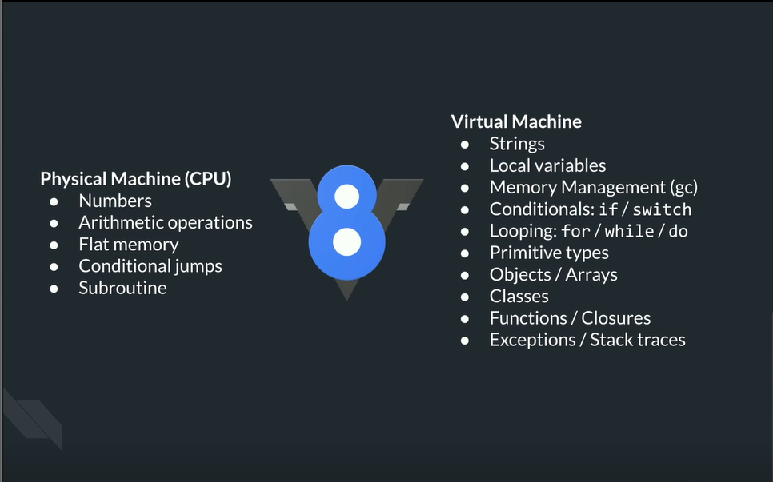
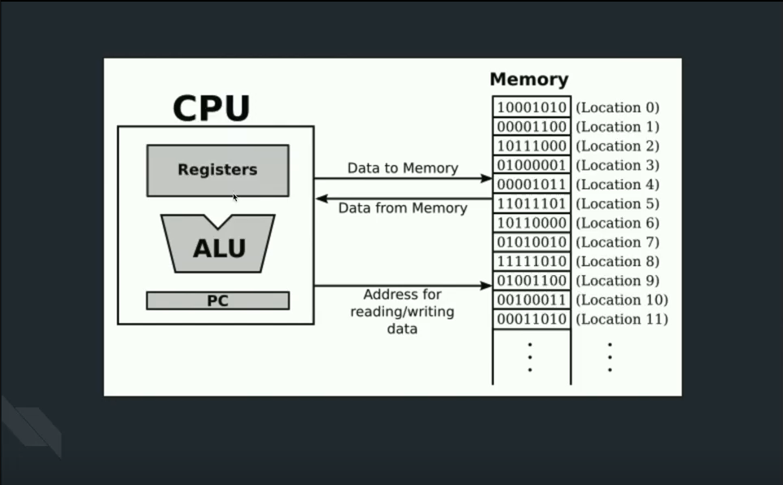

## How CPU runs the code

### Physical & Virtual Machines
- 

- Physical Machine (CPU)
    - Numbers 
    - Arithmetic operations
    - Flat memory 
        - Flat memory model or linear memory model refers to a memory addressing paradigm in which "memory appears to the program as a single contiguous address space."[1] The CPU can directly (and linearly) address all of the available memory locations without having to resort to any sort of bank switching, memory segmentation or paging schemes
    - Conditional jumps
        - sort of if statement
    - Subroutine
        - sort of function but not  very

- Virtual Machine ( in js most popular one: V8) 
    - Strings
    - Local variables
    - Memory Management(GC)
    - Conditionals: If/ switch
    - looping: for, while, do
    - Primitive types
    - Objects/ Arrays
    - Classes
    - Functions / Closures
    - Exceptions / Stack traces

- CPU 
    - Registers : you can think of as local variables 
    - ALU : Arithmetic logic unit: basicly it knows how to do maths
    - PC : Program counter : it is a pointer to the next instruction to read 

### CPU Basics & Speed Limits

### CPU Memory Management

### CPU Subroutines & Calling Conventions

### CPU Q&A

### Fibonacci

---

## Vitrual Machine Inlining & Deopt

### Optimizing Code

### Deopt Explorer & Fixing a Deopt

### Object Shapes & Hidden Classes

---

## Micro Benchmarking

### Object Shapes & Inline Caching

### Inspecting Inline Caches with Deopt Explorer

### Double & Triple Equals

### Object & Array Copying

### Negative Numbers

### Holey Arrays

### Amdahl’s Law
