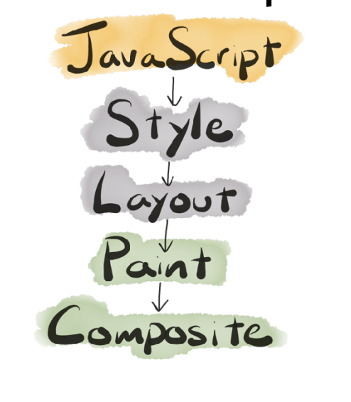
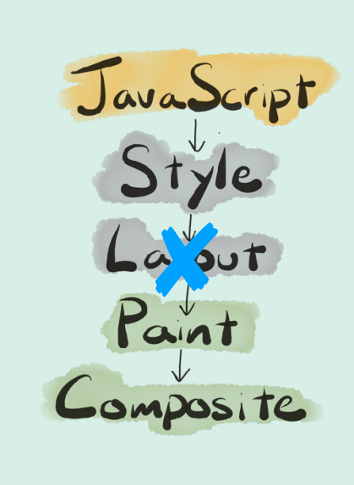
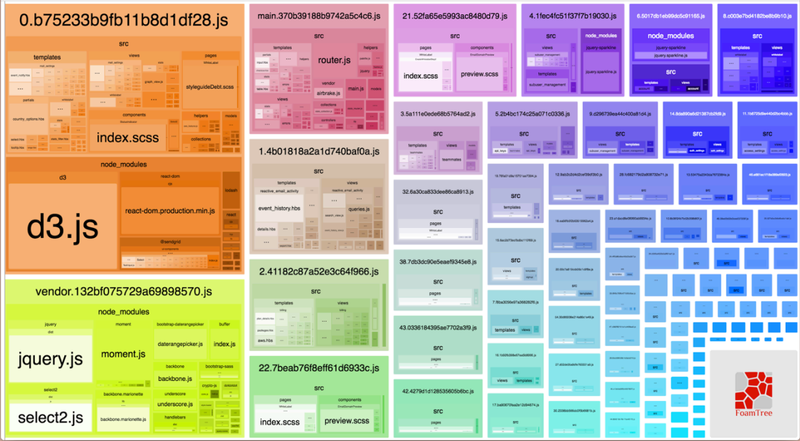

# Web performance

## Why does performance matter

## Cost of Javascript


- Javascript is Compiled language

- Most browsers use something called
  just-in-time (JIT) compilation.

- Things to know about JIT compilation
  - It means that there is compilation step.
  - It means that it happens moments before execution.
  - That means it happens on our client’s machine.
  - That means they’re paying the cost and/or doing the hard
    work for us.

## Parsing

- Parsing can be slow. As slow as **1MB/s on mobile**

- One way to reduce parsing time is to have less code to parse

- Another way is to do as much as parsing as you need and as little as you can get away with

- Parsing happens in two phase

  - **Eager** (full parsing): This is what u think of when you thinkj about parsing
  - **Lazy** (pre-parsing): Do the bear minimum now, We will parse it for realsies later
    - Generally Lazy parsing is good, cuz doing less work is faster than doing work.

- Basic rules

  - Scan Through the top-level scope. Parse all the code you see that is actually doing something.

  - Skip things like function declaration and classes for now. We will parse them when we need them

```javascript
// These will be eagerly-parsed.
const a = 1;
const b = 2;
// Take note that there a function here,
// but, we'll parse the body when we need it.
function add(a, b) {
  return x + y;
}
add(a, b); // Whoa. Go back and parse add()!
```

- Do u see the problem there?

```js
const a = 1;
const b = 2;
// Parse it now!
(function add(a, b) {
  return x + y;
});
add(a, b);
```

- **Micro-optimization** (noun): Thing you read about
  one time and you know pester your co-works about
  in code reviews, even though it has an almost
  unnoticeable impact at scale.

[optimize-js-plugin](https://www.npmjs.com/package/optimize-js-plugin)

- Try avoid nested functions

```js
function sumOfSquares(x, y) {
  //  This will repeatedly be parsed.
  function square(n) {
    return n * n;
  }
  return square(x) + square(y);
}
```

- Better

```js
function square(n) {
  return n * n;
}
function sumOfSquares(x, y) {
  return square(x) + square(y);
}
```

- now it is parsed and turned into abstract syntax tree

> In computer science, an abstract syntax tree (AST) […] is
> a tree representation of the abstract syntactic structure
> of source code written in a programming language. —
> [Wikipedia](https://en.wikipedia.org/wiki/Abstract_syntax_tree)
>
> > Essential, we’ve gone from a big
> > long string of text to an actual data
> > structure representing our code.


- Three things the engine does to help you out

  - Speculative optimization
  - Hidden classes for dynamic lookups
  - Function inlining

- It also turns out that
  JavaScript is **dynamic** / **HARD**.

- But, what if we made some
  assumptions based on what we’ve
  seen in the past?

- We use a system called
  speculative optimization.

- How does this work?

  - We use an interpreter because the optimizing compiler is
    slow to get started.
  - Also: it needs some information before it knows what work
    it can either optimize or skip out on all together.
  - So, the interpreter starts gathering feedback about what it
    sees as the function is used

- But what if a string slips in
  there?

  - The optimizing compiler optimizes
    for what it’s seen. If it sees
    something new, that’s problematic.

- **\*–morphism**

  - Monomorphic: This is all I know and all that I’ve seen. I can
    get incredibly fast at this one thing.
  - Polymorphic: I’ve seen a few shapes before. Let me just
    check to see which one and then I’ll go do the fast thing.
  - Megamorphic: I’ve seen things. A lot of things. I’m not
    particularly specialized. Sorry.

- **Dynamic loopup**

  - This object could be
    anything, so let me look at the rule
    book and figure this out

- Sure, computers are good at looking
  stuff up repeatedly, but they’re also
  good at remembering things.

  - It turns out there is a secret
    type system behind your back.

- **Hidden Class**

```js
const obj = { x: 1 }; // C0
obj.y = 1; // C1
const another = { x: 1, y: 2 }; // C2
```


- Takeaways

  - Turbofan is able to optimize your code in substantial ways
    if you pass it consistent values.
  - Initialize your properties at creation.
  - Initialize them in the same order.
  - Try not to modify them after the fact.
  - Maybe just use TypeScript or Flow so you don’t have to
    worry about these things?

- **Function inlining**

- Larger Takeaways
  - The easiest way to reduce parse, compile, and execution
    times is to ship less code.
  - Use the User Timing API to figure out where the biggest
    amount of hurt is.
  - Consider using a type system so that you don’t have to
    think about all of the stuff I just talked about.

## Javascript performance

- How Web pages are built

  - browser sends a GET request to the server and says - **Hey give me that page**
  - they server sends response and that is just HTML
  - then we parse the html to DOM
  - then we find a link to css and parse it to CSSOM
  - then we aseemble these two OM and build Render tree

- **Render Tree**

  - The Render Tree has a one-to-one mapping with the visible
    objects on the page.
    - So, not hidden object.
    - Yes, to pseudo elements (e.g. :after, :before).
  - There might be multiple rules that apply to a single
    element. We need to figure that all out here.

- Style calculation

  - The browser figures
    out all of the styles that will be
    applied to a given element.

  - THis involves two things :
    - Figuring out which rules apply to which elements.
    - Figuring out how what the end result of an element with
      multiple rules is.

- Syle Matching : `Selector matching`
  - This is the process of figuring out
    what styles apply to an element
  - The more complicated you
    get, the longer this takes.
  - Class names are super
    simple

> [!TIP]
> Stick to simple class names whenever
> possible. Consider using BEM.

- cos

  - Browsers read selectors
    from right to left.
  - The less selectors you use,
    this faster this is going to be.

- Takeaways
- Use simple selectors whenever possible.
  - Consider using BEM or some other system.
- Reduce the effected elements.
  - This is really a way to get to the first one.
  - A little bit of code—either on the server or the client—
    can go a long way.
- Reduce the amount of unused CSS that you’re shipping.
  - The less styles you have, the less there is to check.
- Reduce the number of styles that effect a given element.

---

- **Javascript and The Render Pipeline**

- The things Javascript can do : an incomplete list™️

  - Change the class on an object.
  - Change the inline styles on an object.
  - Add or remove elements from the page.

- The render pipline
  

---

### Layout and Reflows

- Reflows are very expensive in terms of performance, and is
  one of the main causes of slow DOM scripts, especially on
  devices with low processing power, such as phones. In many
  cases, they are equivalent to laying out the entire page again
- Whenever the geometry of an
  element changes, the browser has
  to reflow the page.
- Browser implementations have different
  ways of optimizing this, so there is no
  point sweating the details in this case

- Tasting Notes

  - A reflow is a blocking operation. Everything else stops.
  - It consumes a decent amount of CPU.
  - It will definitely be noticeable by the user if it happens
    often (e.g. in a loop).

- A reflow of an element causes a
  reflow of its parents and children.

- Okay, so what causes a reflow?

  - Resizing the window
  - Changing the font
  - Content changes
  - Adding or removing a stylesheet
  - Adding or removing classes
  - Adding or removing elements
  - Changing orientation
  - Calculating size or position
  - Changing size or position
  - (Even more…)

- Generally speaking, a reflow is
  followed by a repaint, which is also
  expensive.

- How can you avoid reflows?

  - Change classes at the lowest levels of the DOM tree.
  - Avoid repeatedly modifying inline styles.
  - Trade smoothness for speed if you’re doing an animation in JavaScript.
  - Avoid table layouts.
  - Batch DOM manipulation.
  - Debounce window resize events.

- Forced synchronous layout.
  - There are a set of things you can do
    that cause the browser to stop what it’s
    doing and calculate style and layout.
  - Layout Thrashing occurs when JavaScript violently writes,
    then reads, from the DOM, multiple times causing
    document reflows.

<code>const height = element.offsetHeight;</code>

- The browser knew it was going to
  have to change stuff after that first
  line.The browser wants to get you the
  most up to date answer, so it goes
  and does a style and layout check.

- The browser knew it was going to
  have to change stuff after that first
  line.
- Then you went ahead and asked it
  for some information about the
  geometry of another object.

- So, it stopped your JavaScript and
  reflowed the page in order to get
  you an answer

> [!TIP]
> Solution
> Separate reading from writing

- Friendly fact: Production
  mode is important in React!

- Some Takeaways
  - Don’t mix reading layout properties and writing them—
    you’ll do unnecessary work.
  - If you can change the visual appearance of an element by
    adding a CSS class. Do that, you’ll avoid accidental
    trashing.
  - Storing data in memory—as opposed to the DOM—means we
    don’t have to check the DOM.
  - Frameworks come with a certain amount of overhead.
  - You don’t need to use a framework to take advantage of this.
  - You can do bad things even if you use a framework.
  - You may not know you’re layout thrashing—so, measure!

---

### Painting, Layers, the Profiling Thereof

- Anytime you change something other
  than opacity or a CSS transform…
  you’re going to trigger a paint.

- When we do a paint, the browser
  tells every element on the page to
  draw a picture of itself

- It has all of this information form
  when we constructed the render
  tree and did the layout.

- Triggering a layout will
  always trigger a paint.

- But, if you’re just changing
  colors or something—then you
  don’t need to do a reflow. Just
  a repaint.
  

> [!TIP]
> Rule of Thumb:
> Paint as much as you need and as little as you can get away
> with.

- **An Aside: The Compositor Thread**

- Nice threads

  - The UI thread: Chrome itself. The tab bar, etc.
  - The Renderer thread: We usually call this the main thread.
    This is where all JavaScript, parsing HTML and CSS, style
    calculation, layout, and painting happens. There are one of
    these per tab.
  - The Compositor Thread: Draws bitmaps to the screen via
    the GPU.

- The Compositor Thread

  - When we paint, we create bitmaps for the elements, put
    them onto layers, and prepare shaders for animations if
    necessary.
  - After painting, the bitmaps are shared with a thread on the
    GPU to do the actual compositing.
  - The GPU process works with OpenGL to make magic
    happen on your screen

- The Main Thread is CPUintensive

-The Compositor Thread is GPU-intensive.

- It can go off and work on some super
  hard JavaScript computation and the
  animations will still chug along.

- This is cool, because it frees up the
  main thread to do all of the work it’s
  responsible for

> [!TIP]
> Again: Painting is super expensive and
> you should avoid it whenever possible.

- “Let the Compositor Thread handle
  this stuff!”

- Things the compositor thread is really good at:

  - Drawing the same bitmaps over and over in different
    places.
  - Scaling and rotating bitmaps.
  - Making bitmaps transparent.
  - Applying filters.
  - Mining Bitcoin.

- If you want to be fast, then offload
  whatever you can to the less-busy
  thread.

- Disclaimer: Compositing is
  kind of a hack.

- Disclaimer: Compositing is
  kind of a hack.

- What kind of stuff gets its own layer?

  - The root object of the page.
  - Objects that have specific CSS positions.
  - Objects with CSS transforms.
  - Objects that have overflow.
  - (Other stuff…)

- Objects that don’t fall under one of
  these reasons will be on the same
  element as the last one that did.

- (Hint: The root object is
  always its own layer.)

- **You can give the browser hints using the will-change property.**

> ⚠️ **Warning:** Using layers has trade-offs.

- Managing layers takes a certain
  amount of work on the browser’s

- Each layer needs to be kept in the
  shared memory between the main
  and composite threads. behalf.

```
This is a terrible idea.
* {
  will-change: transform;
}
```

- The browser is already trying to
  help you out under the hood.

> [!TIP]
> will-change is for things
> that will change. (Not things that are
> changing.)

- Promoting an object to its own layer
  takes a non-zero amount of time

- will-change is tricky because
  while it’s a CSS property, you’ll
  typically access it using JavaScript.

- If it’s something that the user is
  interacting with constantly, add it to the
  CSS. Otherwise, do it with JavaScript

> [!TIP]
> Clean up after yourself. Remove willchange when it’s not going to change
> anymore.

## Load performance

### Latency and bandwith: A journey of self-discovery

> Networks, CPUs, and disks all hate you. On
> the client, you pay for what you send in
> ways you can't easily see. —Alex Russell

- Bandwidth vs. Latency

  - Bandwidth is how much stuff you can fit through the tube
    per second.
  - Latency is how long it takes to get to the other end of the
    tube.

- TCP focuses on reliability

  - We keep checking in with the server to make sure that everything is
    going well.
  - Packets are delivered in the correct order.
  - Packets are delivered without errors.
  - Client acknowledges each packet.
  - Unreliable connections are handled well.
  - Will not overload the network

- TCP starts by sending a small amount of data
  and then starts sending more and more as
  we find out that things are being successful.

- Fun fact: This is why things feel so
  much worse on a slow Internet
  connection.

- Pro tip: The initial window size is 14kb. So, if you
  can get files under 14kb, then it means you can get
  everything through in the first window. Very cool.

- [link](https://www.cloudping.info/)
- Hmm… So, where is the optimal
  place to put our assets?

---

- Cache Money

  - HTTP/1.1 added the CacheControl response header.

- Caching only affects the "safe" HTTP methods.

  - GET
  - OPTIONS
  - HEAD

- It doesn’t support … because how would it?

  - PUT
  - POST
  - DELETE
  - PATCH

- Cache-Control headers

  - no-store
    -The browser gets
    a new version every time.
  - no-cache - This means you can store a
    copy, but you can't use it without
    checking with the server
  - max-age - Tell the browser not to
    bother if whatever asset it has is less
    than a certain number of seconds old.
  - s-maxage
  - immutable

- Three over-simplified possibilities

  - Cache Missing: There is no local copy in the cache.
  - Stale: Do a Conditional GET. The browser has a copy but it's
    old and no longer valid. Go get a new version.
  - Valid: We have a thing in cache and its good—so, don't
    even bother talking to the server.

---

- Another solution: ContentAddressable Storage

- Caching for CDNs

  - CDNs respect the max-age header just like browsers. But this opens up a new can of worms.
    - We want CSS and JavaScripts to be cached by the browser.
    - We would like the CDN to cache the HTML that it serves up.But we don't want the browser to (because that ends us up in our earlier problem).

- s-maxage is for CDNs only. Tell the
  CDN to keep it forever. But don't tell
  the browser to do it.

- To reiterate: We have no way to reach into all of our
  customers browsers and tell them to purge their
  caches of our assets, but we can tell the CDN to.

---

- Service worker

  -

- **Lazy-loading and pre-loading with React and webpack**
- react-loadable librarty

- Takeaways
  - Some libraries have code you don’t need. See if you can
    get that out of your build.
  - Get the code you need now now.
  - Get the code you need later later.
  - Your tools can help you do this.



---

- some words on http/2

- HTTP/2: What even are you?

  - An upgrade to the HTTP transport layer.
  - Fully multiplexed—send multiple requests in parallel.
  - Allows servers to proactively push responses into client
    caches.

- HTTP/1.1: What’s wrong with you?

  - Websites are growing: more images, more JavaScript
  - Sure, bandwidth has gotten a lot better, but roundtrip time
    hasn’t
  - It takes just as long to ping a server now as it did 20 years ago.
  - That’s right: one file at a time per connection
  - No big deal. It’s not like we are building websites that request
    100 files to something.

- The weird thing is that once you
  have this in place some “best
  practices” become not-so-good.

- Is concatenating all of your JS and
  CSS into large, single files still
  useful?

- What about inlining images
  as data URLs in our CSS?

- purifycss- need look at
- prepack.io

- Avoid Render Blocking

  - Render blocking is anything that
    keeps the browser from painting to
    the screen—or, umm, rendering

- Quick Tip: Make sure your CSS
  <code><link>s are in the <head><code>

- Inlining has trade offs.
  - Sure, it saves you a network request.
  - But, you can’t cache the styles.
  - So, while it might work better for single-page applications,
    you wouldn’t want to include it every HTML page on multipage applications.
  - With HTTP/2, you can actually just avoid this problem all
    together
