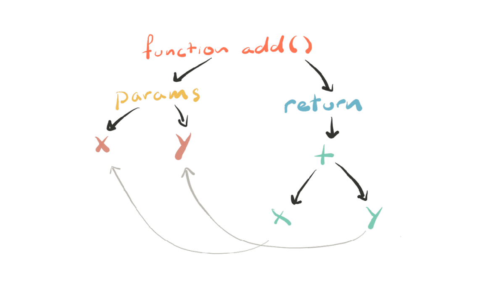
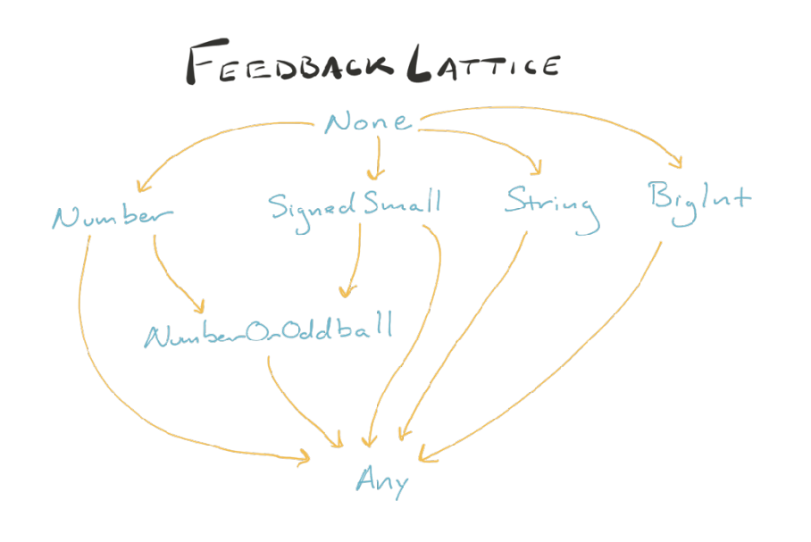

# Web performance

## Why does performance matter

## Cost of Javascript


- Javascript is Compiled language

- Most browsers use something called
  just-in-time (JIT) compilation.

- Things to know about JIT compilation
  - It means that there is compilation step.
  - It means that it happens moments before execution.
  - That means it happens on our client’s machine.
  - That means they’re paying the cost and/or doing the hard
    work for us.

## Parsing

- Parsing can be slow. As slow as **1MB/s on mobile**

- One way to reduce parsing time is to have less code to parse

- Another way is to do as much as parsing as you need and as little as you can get away with

- Parsing happens in two phase

  - **Eager** (full parsing): This is what u think of when you thinkj about parsing
  - **Lazy** (pre-parsing): Do the bear minimum now, We will parse it for realsies later
    - Generally Lazy parsing is good, cuz doing less work is faster than doing work.

- Basic rules

  - Scan Through the top-level scope. Parse all the code you see that is actually doing something.

  - Skip things like function declaration and classes for now. We will parse them when we need them

```javascript
// These will be eagerly-parsed.
const a = 1;
const b = 2;
// Take note that there a function here,
// but, we'll parse the body when we need it.
function add(a, b) {
  return x + y;
}
add(a, b); // Whoa. Go back and parse add()!
```

- Do u see the problem there?

```js
const a = 1;
const b = 2;
// Parse it now!
(function add(a, b) {
  return x + y;
});
add(a, b);
```

- **Micro-optimization** (noun): Thing you read about
  one time and you know pester your co-works about
  in code reviews, even though it has an almost
  unnoticeable impact at scale.

[optimize-js-plugin](https://www.npmjs.com/package/optimize-js-plugin)

- Try avoid nested functions

```js
function sumOfSquares(x, y) {
  //  This will repeatedly be parsed.
  function square(n) {
    return n * n;
  }
  return square(x) + square(y);
}
```

- Better

```js
function square(n) {
  return n * n;
}
function sumOfSquares(x, y) {
  return square(x) + square(y);
}
```

- now it is parsed and turned into abstract syntax tree

> In computer science, an abstract syntax tree (AST) […] is
> a tree representation of the abstract syntactic structure
> of source code written in a programming language. —
> [Wikipedia](https://en.wikipedia.org/wiki/Abstract_syntax_tree)
>
> > Essential, we’ve gone from a big
> > long string of text to an actual data
> > structure representing our code.



- Three things the engine does to help you out

  - Speculative optimization
  - Hidden classes for dynamic lookups
  - Function inlining

- It also turns out that
  JavaScript is **dynamic** / **HARD**.

- But, what if we made some
  assumptions based on what we’ve
  seen in the past?

- We use a system called
  speculative optimization.

- How does this work?

  - We use an interpreter because the optimizing compiler is
    slow to get started.
  - Also: it needs some information before it knows what work
    it can either optimize or skip out on all together.
  - So, the interpreter starts gathering feedback about what it
    sees as the function is used

- But what if a string slips in
  there?

  - The optimizing compiler optimizes
    for what it’s seen. If it sees
    something new, that’s problematic.

- **\*–morphism**

  - Monomorphic: This is all I know and all that I’ve seen. I can
    get incredibly fast at this one thing.
  - Polymorphic: I’ve seen a few shapes before. Let me just
    check to see which one and then I’ll go do the fast thing.
  - Megamorphic: I’ve seen things. A lot of things. I’m not
    particularly specialized. Sorry.

- **Dynamic loopup**

  - This object could be
    anything, so let me look at the rule
    book and figure this out

- Sure, computers are good at looking
  stuff up repeatedly, but they’re also
  good at remembering things.

  - It turns out there is a secret
    type system behind your back.

- **Hidden Class**

```js
const obj = { x: 1 }; // C0
obj.y = 1; // C1
const another = { x: 1, y: 2 }; // C2
```



- Takeaways

  - Turbofan is able to optimize your code in substantial ways
    if you pass it consistent values.
  - Initialize your properties at creation.
  - Initialize them in the same order.
  - Try not to modify them after the fact.
  - Maybe just use TypeScript or Flow so you don’t have to
    worry about these things?

- **Function inlining**

- Larger Takeaways
  - The easiest way to reduce parse, compile, and execution
    times is to ship less code.
  - Use the User Timing API to figure out where the biggest
    amount of hurt is.
  - Consider using a type system so that you don’t have to
    think about all of the stuff I just talked about.
