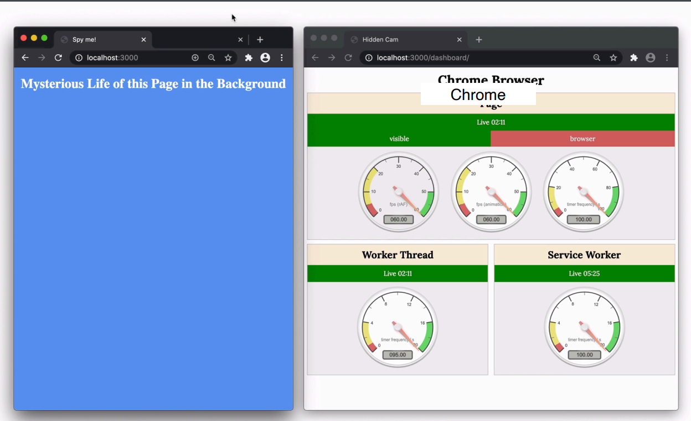
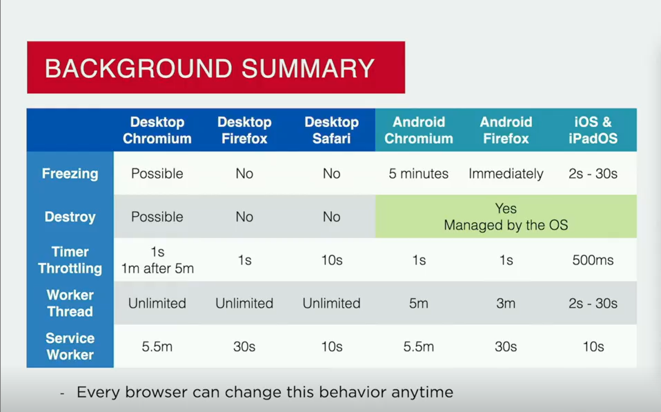
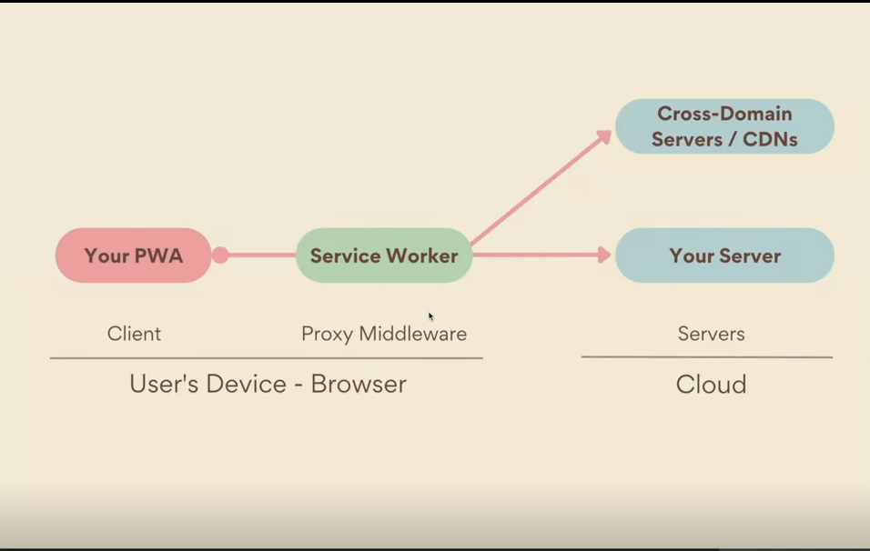
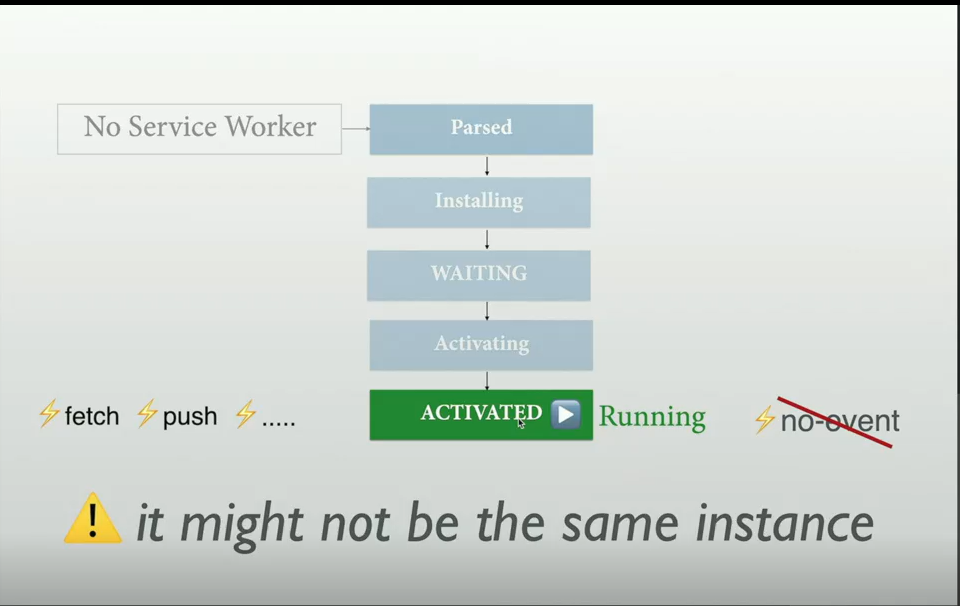

## Background

- We don't have a definition for web apps
  W3C have different definitions for different APIs
  There are many concepts around:

  - **hide/minimize**: in memory and with
    some execution rights
  - **suspend/freeze**: in memory
    with no execution rights
  - **close/kill/discard**: not in memory
    We will try to simplify it

- **Background:** when the user
  stops or pauses the usage of
  the web app

## Web app life cycle

- Possibilities

  - User goes to a new tab
  - User goes to a new window
  - User minimizes the window
  - User closes the window
  - User closes the browser or PWA

- What happens on mobile OS's with app's lifecycle in general?

  - like just think, we do not exist button, like in desktops, actually we do not have that,

- On desktop OS

  - if we have one app open but others are minimized , in desktop they won't stop, they run, if u use alt-tab to change tab, it just changes the tab, does not pause the previous one,

  - in mobile
    - it is like in general actally the opposite of the desktop cycle, if we use one app, and the rest are open in the background, it means in Mobile OS , they are rest are paused, what we see in the recent app list, they are not running they will be shown in just screenshots. or we can say that paused one 'suspended mode'
    - but it may happen that some apps will not be suspended,

- we can see this action in web apps and PWAs

## Observing desktop background Javascript

- We will be starting spying in the background
  - FPS
  - Timers
  - Web Worker execution
  - Service worker execution



- well we see there that an app is open in chrome, and everything is working well, if we switch the tab FPS, request animation frame , thay will be down, and timer will kindof stop also, but web worker and service worket will not stop
  in Safari they all be stopped , so people say it saves more battery, that is why.

- Browser Apps in Desktopn OS(windows, mac, LInux, chrome os)

  - if the app us **Not visible**
    - because of:
      - Background Tab
      - background browser
      - Background PWA
      - Totally covered
    - in that case
      - All apps opened (visible or not)
        - are in memory with execution right
      - web apps not visible
        - may limit timer (1s to 10s)
        - may suspend them(typicaly on chromium alternative)
        - Service worker has its own lifecycle

- Background apps in Mobile OS(iOS, iPadOs)

  - it they are not visible because of:
    - lock screen
    - Home screen
    - Open another app
    - open another tab
  - in that case
    - Web apps in the background
      - Page navigations in memory or not
      - UI is jsut a screenshot, not updated
      - 2s, or 300seconds of executiuon after leaving foreground
      - ifPWA still in memory, opening other PWA s also gove our background PWA execution rights

- BACKGROUND APPS IN MOBILE OSs (Android)

  - not visible
    - Lock screen
    - Home screen
    - Multitask
    - Open other app
    - Open other tab
  - Web apps in the Background
    - Page Navigations in memory or not
    - UI is just a screenshot, not updated
    - Chrome: Up to 5 minutes of execution in background (30s+ for Service Worker)
    - Firefox: Page is stopped immediately, SW: 30s, Worker: 3 minutes

- Summary
  

- Execution rights in the BAckground [options avaiable today]

  - Google Play Store PWA
    - Trusted Web Activity for PWA and native code for background
  - App Store PWA
    - WebView for the user interface in the PWA and Native code for background (it can be JS)
  - Service Worker Background APIs
    - Additions that will be possible in the browser and with installed PWAs (it works on Play Store PWAs also)
  - Audio and Video playing
    - Let the web app run in the background providing video and audio data to keep it playing in the background

- Service worker background APIs
  - on top of the main spec
    - Compatibility differs per browser
    - there amy be used no client running at the time (visibl UI) when used
  - -f we wanna notify the user we are gonna use :
    - WebPush, it is the only api that happenns in the setver side, , and it in any moment can wake up our javascript
    - Background Sync exposes to browser that we have pending pending sync operation, and we are gonna specify the browser that we are gonna update , if we do not use this when we will do thjis is when the user open ur app again, so if we use this it says let's try now
    - periodic Bakcground Sync - it may happpend that every morning, we may want the wake the app, and wanna download some thing even if use is not awake, in that case we will use this
    - Background fetch- what if the user wanna download like large data, and if we do this in our main thread it would block other thigs, so we use background fetch
    - Payment handler - there is an api that handles the payment wiht pament system, like anythign, so in thatr case this one what we are telling Payment handler is for authorization, that we may ge teh money after 5 min, so first we should authorze the user, then we can charge the money whenever we want
- servioce worker apis are avaible in all chromium brpwsers, but some non chromium browsers could disable them
- in Safari only web push is vavaialble
- in firefox also only Webpush

## Background Detection

- let's talk about PWA lifecycle

  - we are in open page
    - if we go another app, and put current holding to background we will have one event Visibility change
      - Visibility
    - An app will be suspended in andorid in 5 min, but in ios it is 3 secons, in the background it is goind to actually free the whole content
      - freeze
    - if the user goes to the app again , in that case , our code starst to execute again, and in this moment we will have resume and visibity change
      - resyme
      - visibility change
    - there might be a situation that our app might be discarded, like in an moment that takes lot's of memory, like recording a video, in that moment if the user goes to pwa browser see that it was discarded so it loads again, to check it that is discarded theer is a boolean in chrome that tells if it is discarded or not :
      - load
      - wasDiscarded
  - from our web app to another web app

    - deskop
      - all apps will be running in memory, so we wil trigger two actions
        - visibilitychange
        - blur
    - Mobile and some desktop sitations
      - only current one will be running in memory the rest are suspendded so, pwa goes to a suspended state , we will trigger two actions
        - visibilitychange
        - freeze(_chromium only_)
    - at any time app can be discarded, and it is done by the OS, ex, sometimes if we go the another tabb and come back later our app could be running, but sometimes it will restart , this is the case that is was disarded, there are two events are triggered at that moment:
      - load
      - document.wasDiscarded = true
        - wasDiscarded is true, that is state that persist in the whole load the same as how it started, for example if it starts with false it stays false , else if opposite.

  - Detection

  - Because there are many possibilities for
    background, there are many APIs and ways
    to detect getting in/out of "background".

  - only one is cross-paltform and cross possibility **Page Visibility API**

## Visibility change detection

```js
window.addEventListener('visibilitychange', (event) => {
  if (document.visibilityState == 'hidden') {
    // we are in background
    // on some devices , last chance to save current state
  } else {
    // we are in the foreground
  }
});
```

## Freezing detection

- Page lifecycle API let us detect if a page navigation is frozen by the browser and /or if it is resumed
- Only available on some Chromium-browsers such as Google Chrome for desktop

```js
window.addEventListener('freeze', (event) => {
  // we will be suspended
  // we have current app's state (custome code)
  saveState();
});
```

- when we are back

```js
window.addEventListener('resume', (event) => {
  // we are back from suspention
  // no need to restore
});
```

- but there could be a state that our tab or our whole browser was discarded, in the case we should restore the content

```js
window.addEventListener('DOMContentLoad', (event) => {
  if (document.wasDiscarded) {
    // we are back from suspension but it was discarded
    restoreState(); // our custom code
  }
});
```

## Page Lifecycle API on Mobile devices

- it is not typically available
  - you can save state
    - On visibilitychange (include a timeStamp)
  - when you should restore the state
    - when page loads
    - using the saved timestamp you can decide to restore state or start a new navigation

## Service Workers

- thread
- runs in the background
- A JavaScript file running in its own thread that will act as a
  middleware offering a local installed web server or web
  proxy for your PWA, including resources and API calls

- service worker
  - Runs client-side in browser's engine
  - HTTPS required
  - Installed by a web page
  - Own thread and lifecycle
  - Acts as a network proxy or local web server
  - in the name of the real server
  - Abilities to run in the background
  - No need for user's permission


[link to chrome dicards](chrome://discards/graph)

- only one service worker can we active in one scope



[link to chrome service worker internals](chrome://serviceworker-internals/)

- Service worker can execute code in the background without any window client
- we can wake service worker not at any time, at some particular times, browser developers has some sequrity implementations, like we shoould notify the user after some seconds likely 3-5 seconds after waking service worker up, otherwise the browser auttomtically notify the user that 'this website is updated' , but if user declines to send notifications we could be banned waking up the service worker forever i think

- service workers shoudl have their own life, so we should write the file in the root level directory

## Notification and UI

- When we are in the
  background, updating the UI if
  possible won't notice the user

- History
  - Historically we could only notify the user for background tabs changing
    - `<title>` (changed by JS or refresh meta)
    - Favicon (even animating it)
    - playing audio
    - Focus a re-focus ,such as requesting a modal UI such as an alert dialog(but not working now in most browsers)
  - well, also we had tricks to make it difficult to unload the page

[link to see an example animating favicon and time throttling](https://rpsthecoder.github.io/square-loading-favicon/)

- Today

  - web notifi cations is only cross-platform solution
  - but it requires user's permissions and it's the same permission as the one for Push messaging
  - there are two APIs for creating the notifications
  - Desctop notifications, for windwos and workers but not for service workers
  - Web Push , for Service workers scope

- Step 1: ask for notification permissions

  - DO not do this when page loads. Follow deisgn patters

  > `script.js`

  ```js
  if ('Notification' in window) {
    if (Notification.permission === 'granted') {
    }
    status = await Notification.requestPermission();
    // it can we 'granted', 'denied', 'default'
    // if denied we cannot send again, if we ask again it will be autopmaitically denied ,
    // when it is default we can ask later again
    // it is the same permission for Web Push and old Desktop Notification APIs
  }
  ```

- Step 2: Creating the Notification

  - old Desktop Notification API; not avaiable on the Sevice Workers

  > `script.js`

  ```js
  const n = new Notification('Title', {
    body: 'Text',
    icon: 'image-url',
  });

  // we can close it later n.close()
  // this is classic one we actually wont use
  ```

- Desktop Notification API

  - t's a local notification
  - Only available on Windows and Workers (not within Service Workers)
  - We can update the same notification in the future
  - Events: show, click, error
  - Deprecated on Android in favor of the
  - Web Push notification
  - marked as **deprecated** on android

- Media Playing

  - in the case you web app plays audio or video, there are special cases for the background playing
  - Picture in picture API for video
  - Media Session API for metadata

- Media Session APi

  - Provides metadata and events

  > `script.js`

  ```js
  navigator.mediaSession.metadata = new MediaMetadata({
    title: 'Best Song',
    artist: 'Max Flirtma',
    album: 'Progressive web Apps',
    artwork: [
      /* */
    ],
  });

  // action: play, pause, stop, previous track, nexttrack, ...
  navigator.mediaSession.setActionHandler(action, (e) => {});


  // -----
  navigator.mediaSession.setActionHandler('play', () =>= { });
  navigator.mediaSession.setActionHandler('pause', () =>= { });
  navigator.mediaSession.setActionHandler('stop', () =>= { });
  navigator.mediaSession.setActionHandler('seekbackward', () =>= { });
  navigator.mediaSession.setActionHandler('seekforward', () =>= { });
  navigator.mediaSession.setActionHandler('seekto', () =>= { });
  navigator.mediaSession.setActionHandler('previoustrack', () =>= { });
  navigator.mediaSession.setActionHandler('nexttrack', () =>= { });
  navigator.mediaSession.setActionHandler('skipad', () =>= { });
  navigator.mediaSession.setActionHandler('hangup', () =>= { });
  navigator.mediaSession.setActionHandler('togglecamera', () =>= { });
  navigator.mediaSession.setActionHandler('togglemicrophone', () =>= { });


  ```

- Picture in Picture API

  - for video playing

  > `script.js`

  ```js
  // Toggl PiP
  if (document.pictureInPictureElement) {
    document.exitPictureInPicture();
  } else if (document.pictureInPictureEnabled) {
    video.requestPictureInPicture();
  }
  ```

- Picture in Picture

  - New events for `<video>`
    - enterpictureinpicture
    - leavepictureinpicture
  - You can't add HTML UI to the PiP video
  - You can customize the `<video>` using a CSS
  - pseudo class :picture-in-picture
  - You can toggle PiP in/out with JS
  - Controls are defined through Media Session

- Beakon API

  - why do we want to execute code in the background?

    - Network Requests
      - if your web app goes to the background while netwrok request is in the process , it may be aborted
    - Sync Data
    - Notify the User
    - Continue pending task

  - Network Requests

    - if your web app goes to the background while netwrok request is in the process , it may be aborted
    - Solution:
      - **Beakon API** if suitable
      - Web Background Synchronization API

  - Beacon API

    - for requests where we do not care about its response

    > `script.js`

    ```js
    document.addEventListener('visibilitychange', () => {
      if (document.visibilityState === 'hidden') {
        navigator.sendBeacon('/log-hidden', someData);
      }
    });
    ```

## Background Sync

- You can wake up your code client-side while in the backgrolund and / or continue executing code after leaving the web app using

  - APIs in use for this purpose

    - Background Sync
    - Periodic Background Sync
    - Background Fetch

  - Remember execyution happens in the background; maybe no PWA's page is currently loaded. Use Web Notifications for messaging the user

- **Backgroiund Sync**

  - PWa defers a sync action until the device has a stable connection to the server
  - A 'sync' event will be fired in the Service worker to handle a pending sync

    - immegiately if the network is stable
    - Later, when the network go back to stable
    - If the battery is in good level

  - We access the network and fulfill the sync or leave it pending
  - 5% of mobile web apps with a Service Worker
    are already using the API

- **Steps: 1**

  > `script.js`

  ```js
  if ('SyncManager' in window) {
    const registration = await navigator.serviceWorker.ready;
    registration.sync.register('tag-name');
  }
  ```

  - Service worker canot access to the local storage , it can use index db , so consider that also, if you need to save data while syncing , use indexDb

- **Steps: 2**

  > `serviceWorker.js`

  ```js
  self.addeventListener('sync', (event) => {
    if (event.tag == 'tag-name') {
      event.waitUntil(syncOperation());
    }
  });
  ```

## Perodic background sync - [chromium only]

- PWA asks user for permission to periodically
  execute code in the backgroun
- a 'periodicsync' event will be fired in the servifce worker

  - On a syncronizatin time interval
  - if batery and network conditions are met

- we typically access the network on each execution, but it is nto manadatory
- Right now, it is fired with a maximum of once every 12 hours

- Execution frequency will be
  honored based on a Site
  Engagement Score defined by
  the browser [yes browser e.x chrome scores every website and it depends on the user;s interaction with your website, in the beginning if the user is visiting your site for the first time periodic sync previlages will not be granted for your site , after using more browser sees and grant you the permission]

- **Step: 1 Ask for the Periodic sync permission[actually we are asking frm the browser not the user]**

  - Permission will be granted based on the Site engagement score by the browser

  > `script.js`

  ```js
  const permission = await navigator.permission.query({
    name: 'periodic-background-sync',
  });

  if (permission.state === 'granted') {
    track('periodic-sync', 'granted');
  } else {
    track('periodic-sync', 'denied');
  }
  ```

- **Step: 2 Register a Background sync operation**

  - It requres a tag and a sychronization interval in milliseconds

  > `script.js`

  ```js
  const registeration = await navigator.serviceWorker.ready;
  IF('periodicSync' in registration) {
    try {
      await registration.periodicSync.register('sync-tag', {
        minInterval: 24 * 60 * 60 * 1000, // One day
      });
    } catch (error) {

    }
  }
  ```

- **Step: 3 Handle a periodic sync operation**

  - It will be executed in the Service worker

  > `serviceWorker.js`

  ```js
  self.addEventListener('periodicSync', (event) => {
    if (event.tag === 'sync-tag') {
      event.waitUntil(doPeriodicSyncOperation());
    }
  });
  ```

## Background Fetch

- PWA asks the web engine to make some fetch download requests
- the browser will download the requests in the background while showing an OS notification about the process
- event will be fired in the Service worker when:

  - Download finishes
  - if the user clicked the notification
  - On abort or failure
  - on progress

- **Step: 1 Start a Background Fetch Request**

  - The operation will be handled entirely by the browser

  > `script.js`

  ```js
  const registration = await navigator.serviceWorker.ready;

  if('backgroundFetch' in registration) {
    const fetch = await registration.backgroundFetch.fetch(
      'fetch-name',
      ['url-1', 'url-2', 'url-3'],
      <!-- { // this metadata will go to notificatins
        title: 'Offline Content',
        icons: [{ sizes: '300x300', src: 'icon.png', type: 'image/png' }],
        downloadTotal: 20 * 1024 * 1024, // it is gonna be used for te progress bar, but it is optional
      } -->
    );
  }
  ```

- **Step: 2 Handle events in the Service Worker**

  > `serviceWorker.js`

  ```js
  self.addEventListener('backgroundfetchsuccess', async (event) => {
    const downloadedFiles = await event.registration.matchAll();
  });
  self.addEventListener('backgroundfetchclick', (event) => {
    clients.openWindow('/download-status');
  });
  self.addEventListener('backgroundfetchfailure', (event) => {});
  ```

## Push notifications

- PWA asks permission to send ntifications to the user
- if granted, now the service worker can create a notification from the background
- aslo , the PWA can suscribe the user to Push
- A 'push' event will be fired in the Service Worker to handle a push
- avaiable : Firefox, Chrome, Edge, Samsung internet
- Safari from macOS 13(Ventura), IOS and iPadOs frm some verions from 2023

- **Step: 1 Ask for the notification permissions**

  - Do not do this when the pag loads, Follow design patterns

  > `script.js`

  ```js
  if ('Notification' in window) {
    if (Notification.permission === 'granted') {
      track('notification', 'granted');
    }

    status = await Notification.requestPermission();
    // it can be 'granted', 'denied', 'default'
    track('notification-request', status);
  }
  ```

  

  > there Subscription details will be returned after getting the permission from the user

- **Step: 2 Register a Push Subscription**

  - Check course's code for instruction for get a key

  > `script.js`

  ```js
  if ('PushManager' in window) {
    const registration = await navigator.serviceWorker.ready;
    const pushData = await registration.pushManager.subscribe({
      userVisibleOnly: true,
      applicationServerKey: 'KEY',
    });
    if (pushData) {
      // we have the Push Subscription details to save in our server
    }
  }
  ```

  ```js
  // this is the data we will get as Subscription details
  {
    "endpoint": "https:///pushserver.com/unique-id",
    "keys": {
      "p256dh" :
        "BNcRdreALRFXTkOOUHK1EtK2wtaz5Ry4YfYCA_0QTpQtUbVlUls0VJXg7A8u-
          Ts1XbjhazAkj7I99e8QcYP7DkM=",
      "auth"   : "tBHItJI5svbpez7KI4CCXg==="
    }
  }
  - Subscription details from the Push server
  > It includes an end-point, a unique ID for that user in that browser and public keys we have to use later to encrypt messages to that user
  > We need to store this data safely in our web server and assign it to the user

  ```

  

**Step: 3 Recieve the push and create notification**

> `serviceWorker.js`

```js
self.addEventListener('push', event => {
  event.waitUntil(
    self.registration.showNotification('Title', {
      body: event.data.text(),
      icon: "/icon.png'
    })
  )
})
```

- Push messagecan arrive when a web app is active or it is closed
- You are not forced to notify the user with the payloads body, but you are forced to notify something
