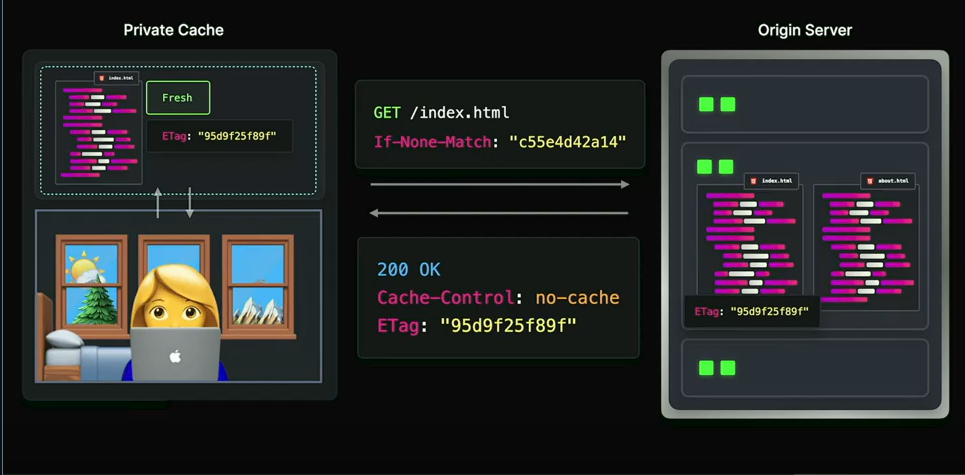
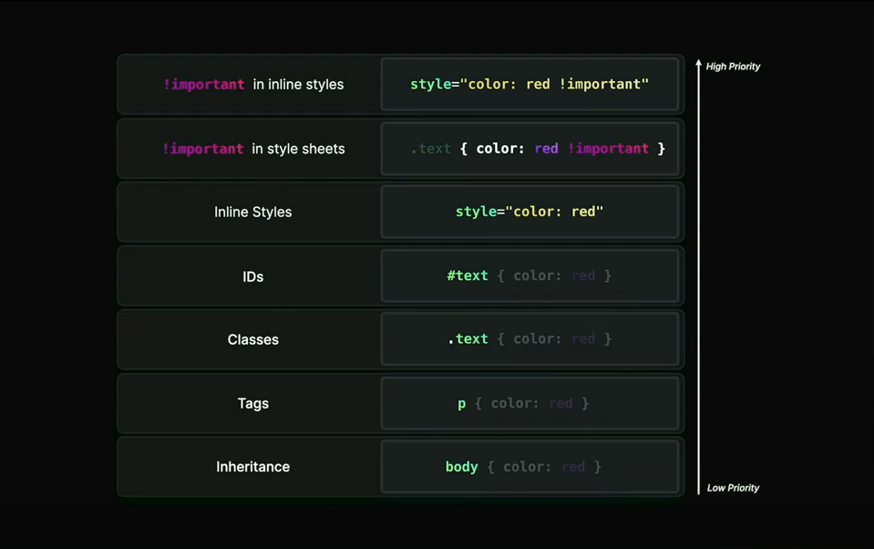

# Web development quiz

## async and defer execution order

- A `<script async src='async2.js' />` loads in 50ms
- B `<script async defer src='asyncdefer1.js' />` loads in 60ms
- C `<script async src='async1.js' />` loads in 300ms
- D `<script defer src='defer1.js' />` loads in 200ms
- E `<script defer src='defer2.js' />` loads in 300ms

- let's see first how js script is loaded and executed normally
  

  - there we can see that, while parsing the html in main thread , parser will see the javascript file link, then it stops parsing and starts loading javascript after taht it executes javascript then continues parsing html

- let's see with async
  

  - there we can see while laoding script parser in the meantime continues parsing the html also after it full load script executes js then continues parsinmg again

- let's see with defer
  

  - there we can see that when parser sees the script tag file, it in the maintime of parsing also loads the script but does not execute that , after html is fully parsed then it executes the script

- now after getting enough informations, let's see our example's execution order

  

  - there what we see , like in teh order above,

## Rendering Pipeline and Compositing

- A - The render tree contains all elements from the DOM and CSSOM combined.

- B - Compositing is the process of separating layers based on z-index, which are then
  combined to form the final image displayed on the screen.

- C - The layout process assigns colors and images to the visual elements in the render tree.

- D - The composting process happens on the compositor thread.

- E - Elements that aren't visible on the page, for example display: hidden, aren't part of the
  DOM tree.

- Answers: D

## Resolving Domain Requests

- Browser sends request to **1 Recursive DNS Resolver**
  **1 Recursive DNS Resolver** queries **2 Root Name Server**
  **2 Root Name Server** responds with **4 Top Level Domain Name Server** IP address
  **1 Recursive DNS Resolver** queries **4 Top Level Domain Name Server**
  **5 Top Level Domain Name Server** responds with **5 Authoritative Name Server** IP address
  **1 Recursive DNS Resolver** queries **5 Authoritative Name Server**
  **5 Authoritative Name Server** responds with website's **3 IP Address**

- let's see the process
  
    
  
  
  
  

## Call Stack & Event Loop

```javascript
setTimeout(() => console.log(1), 0); // console.log(1) -> get's to task queue

Promise.resolve().then(() => console.log(2)); // console.log(2) goes to micro task queue

Promise.resolve().then(() => setTimeout(() => console.log(3), 0)); -> // setTimeout goes to microtask queue

new Promise((resolve, reject) => {
  console.log(4);
}); // this one instantly calles so first console is 4

setTimeout(() => console.log(5), 0); // this one goes to macro task queue

// now we start from emptying the microtask queue
// first in micro task queue is console function it does it's job and in the console 2
// then we have set time out in micro , it get's executed and setTimeout 's fucntion goes to task queue
// the our micro task is empty, let's start from task queue
// nwo first fucntion in task queue is 1
// second is 5
// third one is 3 which was at first setTimeOut in promise then went to macrop task again
```

```javascript
// 4
// 2
// 1
// 5
// 3
```

## Resource Hints

- dns-prefetch - performs domain name resolution in the background
- preconnect - proactively performs DNS resolution and TCP/TLS handshake
- prefetch - requests non-critical resources in the background
- preload - prioritizes fetching of critical resources needed for the current navigation

## Object Reference & Destructuring

```javascript
const member = {
  name: 'Jane',
  address: { street: '101 Main St' },
};
const member2 = { ...member };
member.address.street = '102 Main St';
member.name = 'Sarah';

console.log(member2); // { name: "Jane", address: { street: "102 Main St" }}
```


## Put the PerformanceNavigationTimings in the right order

- 6. loadEventStart
- 5. domComplete
- 4. domContentLoadedEventStart
- 1. fetchStart
- 2. connectEnd
- 3. domInteractive

## Match the caching directives to their definitions

- A. no-cache
  - validates a cached response with the origin server before using it, even if it is still fresh
    
    
    
- B. must-revalidate
  - validates a stale response with the origin server before using it
    
    
    
- C. no-store
  - doesn't cache any part of the request or response
    
- D. private
  - prevents caching on shared caches
    
- E. stale-while-revalidate
  - serves stale content while validating the cached response with the origin server
    
    
    

## What statements are true about this code block?

```js
function addMember(name) {
  return { name, createdAt: Date.now() };
}

let obj1 = addMember('John');
let obj2 = addMember('Sarah');

obj1.friend = obj2;
obj2.friend = obj1;

obj1 = null;
obj2 = null;
```

- A. obj1 and obj2 cannot be garbage collected, leading to a memory leak
- B. obj1 and obj2 will be garbage collected immediately after setting them to null
- C. obj1 and obj2 will only be garbage collected after closing the browser tab
- true = D. obj1 and obj2 can be garbage collected during the next garbage collection cycle 

## When animating the following properties, which have the correctly listed rendering costs?

- A. width: Layout, Paint, Composite +
- B. opacity: Paint, Composite -
- C. background-image: Composite -
- D. left: Layout, Paint, Composite +
- E. transform: Paint, Composite -

## What gets logged when clicking button?

```js
<div class="outer">
  <div class="inner">
    <button>Click me!</button>
  </div>
</div>

 ---------

outer.addEventListener("click", () => log("A"), true);
outer.addEventListener("click", () => log("B"));
inner.addEventListener("click", () => log("C"), true);
inner.addEventListener("click", (e) => {
   log("D");
   e.stopPropagation();
   log("E");
});
button.addEventListener("click", () => log("F"));
button.addEventListener("click", () => log("G"), true);

A
C
G
F
D
E
```

## Order the CSS selectors by ascending specificity

- A. div h1.large-text::before
- B. div h1:first-child
- C. h1:not(.small-text)
- D. .large-text:nth-child(1)
- E. h1.large-text[id="title"]
- F. h1.large-text#title




---

### 12. Order the CSS selectors by ascending specificity

- A. `div h1.large-text::before`
- B. `div h1:first-child`
- C. `h1:not(.small-text)`
- D. `.large-text:nth-child(1)`
- E. `h1.large-text[id="title"]`
- F. `h1.large-text#title`

<details>
<summary>💡 <b>Answer: </b></summary>
 <br />
 

</details>

---

### 13. What statements are true?

```js
const userTokenMap = new WeakMap();

let user = {
  name: 'Jane Doe',
  age: 24,
};

userTokenMap.set(user, 'secret_token');
```

- A. `userTokenMap` implements the iterator protocol
- B. When setting `user` to `null`, `userTokenMap` returns `0`
- C. If the user object is set to `null`, its `userTokenMap`  entry can be be garbage collected.
- D. `[...userTokenMap]` returns an array of `userTokenMap` entries

<details>
<summary>💡 <b>Answer: </b></summary>
 <br />


</details>

---

### 14. Match the Web Vitals to the correct descriptions

- A. TTFB
- B. FID
- C. TTI
- D. TBT
- E. CLS
- F. INP

1. the time it takes for a webpage to respond to a user's first interaction.
2. the time that the main thread is blocked from responding to user input.
3. the average time it takes for a webpage to update its visuals after a user interacts with it.
4. the time it takes for the server to respond to a request and start sending data back to the client
5. the time it takes for a webpage to be fully loaded and responsive to user input.
6. the stability of a webpage's layout, or the unexpected layout shifts that occur on a webpage as it loads.

<details>
<summary>💡 <b>Answer: </b></summary>
 <br />


</details>

---

### 15. Which Answer: will be allowed with the following CSP header?

```js
default-src "none"; script-src "self"; img-src "self" example.com; style-src fonts.googleapis.com; font-src fonts.gstatic.com;
```

- A. `<script src="/js/app.js"></script>`
- B. `fetch("https://api.website.com/data")`
- C. `@font-face { url("fonts/my-font.woff") }`
- D. ``
- E. `<style>body { font-family: 'Roboto' }</style>`
- F. `<iframe src="https://embed.example.com"></iframe>`
- G. `<link rel="stylesheet" href="https://fonts.googleapis.com..>`
- H. `<video src="https://videos.example.com/..."></video>`

<details>
<summary>💡 <b>Answer: </b></summary>
 <br />


</details>

---

### 16. Which statements are true?

- A. `rel="noopener"` is used to prevent the original page from accessing the `window` object of the newly opened page
- B. `rel="noreferrer"` can be used to prevent the newly opened page from accessing the `window` object of the original page
- C. `rel="noopener"` and `rel="noreferrer"` can only be used with HTTPS
- D. `rel="noopener"` can be used to prevent tabnabbing
- E. The default `Referrer-Policy` is `no-referrer-when-downgrade`

<details>
<summary>💡 <b>Answer: </b></summary>
 <br />


</details>

---

### 17. When does `"In log: My input!"` get logged?

```js
function* generatorFunc() {
  const result = yield 'My input!';
  console.log('In log:', result);
  return 'All done!';
}

const it = generatorFunc();
```

- A. `it.next()`
- B. `it.next("My input!")` `it.next()`
- C. `it.next()` `it.next("My input!")`
- D. `it.next()` `it.next()`

<details>
<summary>💡 <b>Answer: </b></summary>
 <br />


</details>

---

### 18. Connect the Promise methods to the right output

```js
const promises = [
   new Promise(res => setTimeout(() => res(1), 200),
   new Promise(res => setTimeout(() => res(2), 100),
   new Promise((_, rej) => setTimeout(() => rej(3), 100),
   new Promise(res => setTimeout(() => res(4), 300)
];

Promise[❓]
   .then(res => console.log("Result: ", res))
   .catch(err => console.log("Error: ", err)
```

- A. `all`
- B. `any`
- C. `race`
- D. `allSettled`

1. `Result: 2`
2. `Error: 3`
3. `Result: [{}, {}, {}, {}]`
4. `Result: 2`

<details>
<summary>💡 <b>Answer: </b></summary>
 <br />


</details>

---

### 19. Which of the following values will always make your page ineligible for bfcache?

- A. `unload`
- B. `pagehide`
- C. `onbeforeunload`
- D. `pageshow`
- E. All of the above
- F. None of the above

<details>
<summary>💡 <b>Answer: </b></summary>
 <br />


</details>

---

### 20. Connect the terms with their definitions

- A. XSS
- B. CSRF
- C. UI Redressing
- D. MITM

1. allows attackers to inject malicious scripts into web pages viewed by others
2. tricks users into interacting with disguised or hidden elements
3. tricks users into executing unwanted actions by exploiting their authenticated session
4. allows attackers to intercept and modify communication between two parties without their knowledge

<details>
<summary>💡 <b>Answer: </b></summary>
 <br />


</details>

---

### 21. Connect the font strategies to their definition

- A. `font-display: block`
- B. `font-display: swap`
- C. `font-display: fallback`
- D. `font-display: optional`
- E. `font-display: auto`

1. temporarily render an invisible font until the custom font has been downloaded
2. use a fallback font while the custom font is downloading, switch to the custom font when available
3. only use the custom font if it is available, otherwise use a fallback font
4. allows the browser to determine the most appropriate behavior for font loading
5. use the custom font if it is available, use a fallback font if the custom font is not available

<details>
<summary>💡 <b>Answer: </b></summary>
 <br />


</details>

---

### 22. What statements are true about the following cookie header?

```js
Set-Cookie: my-cookie="value"; Domain="website.com"; Secure; HttpOnly;
```

- A. This cookie is accessible from `www.website.com`, but not from `blog.website.com`
- B. This cookie can only be set client-side on the `website.com` domain
- C. This cookie gets treated like a session cookie
- D. This cookie will be sent when navigating from another website to `www.website.com`

<details>
<summary>💡 <b>Answer: </b></summary>
 <br />


</details>

---

### 23. Which of the CSS (pseudo)selectors can we use to only target the first list item `<li>One</li>`?

```html
<div>
  <ul>
    <li>One</li>
    <ul>
      <li>Two</li>
      <li>Three</li>
    </ul>
  </ul>
  <ul>
    <li>Four</li>
  </ul>
</div>
```

- A. `ul:first-child > li`
- B. `ul:first-child + li`
- C. `ul:first-child > li:first-child`
- D. `ul:first-of-type > li:first-of-type`
- E. `ul:first-child + li:first-child`

<details>
<summary>💡 <b>Answer: </b></summary>
 <br />


</details>

---

### 24. What is true about the following header?

```js
Strict-Transport-Security: max-age=31536000; includeSubdomains;
```

- A. The header enforces HTTPS for one year on the domain and its subdomains
- B. When `max-age` expires, browsers will default to HTTP
- C. The `max-age` is refreshed every time the browser reads the header
- D. Insecure requests to subdomains are allowed

<details>
<summary>💡 <b>Answer: </b></summary>
 <br />


</details>

---

### 25. Which of the following properties causes the element to be promoted to its own RenderLayer?

- A. `z-index: 1`
- B. `translate3d: (0, 0, 0)`
- C. `will-change: transform`
- D. `transform: rotate(45deg)`
- E. `position: fixed`
- F. `position: absolute`

<details>
<summary>💡 <b>Answer: </b></summary>
 <br />


</details>

---

### 26. Match the image formats to the descriptions

- A. JPEG
- B. PNG
- C. WebP
- D. AVIF

1. Both lossy and lossless compression, supports HDR and WCG, supports transparency
2. Both lossy and lossless compression, supports transparency, supports progressive rendering
3. Lossless compression, high quality, supports transparency, larger file size
4. Lossy compression, supports progressive rendering

<details>
<summary>💡 <b>Answer: </b></summary>
 <br />


</details>

---

### 27. What is true about the following CORS config?

```js
Access-Control-Allow-Origin: https://www.website.com
Access-Control-Allow-Headers: Content-Type
Access-Control-Allow-Methods: *
Access-Control-Expose-Headers: X-Custom-Header
Access-Control-Max-Age: 600
```

- A. A preflight request is required
- B. Only requests from `https://www.website.com` are allowed
- C. Requests with cookies are allowed
- D. The actual response is cached for 600ms
- E. `X-Custom-Header` will be the only included response header
- F. `GET`, `POST`, `PATCH` and `PUT` methods are allowed, but not `DELETE`

<details>
<summary>💡 <b>Answer: </b></summary>
 <br />


</details>

---

### 28. What gets logged?

```js
setTimeout(() => console.log(1));

(async () => {
  console.log(2);
  await Promise.resolve();
  console.log(3);
})();

Promise.resolve().then(() => Promise.resolve().then(() => console.log(4)));
```

- A. `1` `2` `3` `4`
- B. `2` `4` `3` `1`
- C. `2` `3` `4` `1`
- D. `2` `3` `1` `4`

<details>
<summary>💡 <b>Answer: </b></summary>
 <br />


</details>

---

### 29. What statements are correct?

- A. HTTP/2 allows multiple requests and responses concurrently over a single TCP connection
- B. HTTP/3 can only be used with HTTPS
- C. HTTP/2 is backward compatible with HTTP/1.1
- D. HTTP/1.1 requires multiple TCP connections to process multiple requests simultaneously

<details>
<summary>💡 <b>Answer: </b></summary>
 <br />


</details>

---

### 30. What gets logged?

```js
const objA = {
  type: 'A',
  foo() {
    console.log(this.type);
  },
};

const objB = {
  type: 'B',
  foo: objA.foo,
  bar: () => objA.foo(),
  baz() {
    objA.foo();
  },
};

objB.foo();
objB.bar();
objB.baz();
```

- A. `A` `B` `B`
- B. `B` `A` `A`
- C. `A` `A` `A`
- D. `A` `undefined` `A`
- E. `B` `undefined` `B`

<details>
<summary>💡 <b>Answer: </b></summary>
 <br />


</details>
